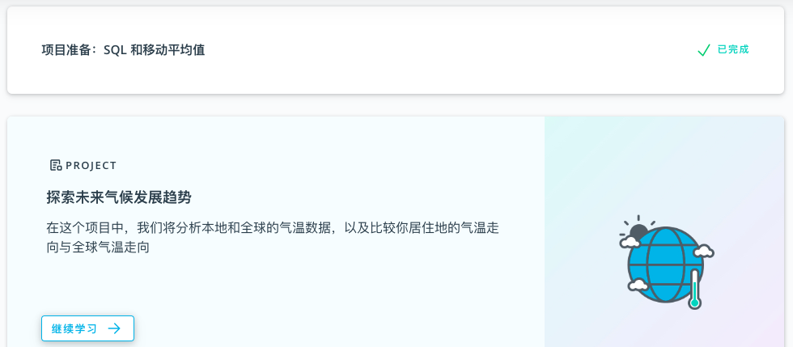
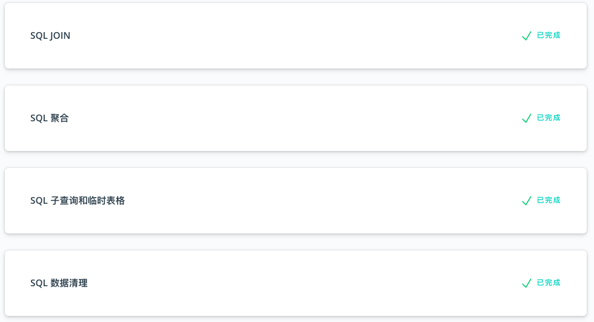

# P1

## 1. 项目介绍

在这个项目中，你需要完成对未来气候发展趋势的探索任务，描绘全球温度数据，并对比你所在城市的温度，最后呈现可视化成果。

## 2. 能力要求

1. 使用数据库语言 SQL 从数据源中取数
2. 设定描述指标，使用移动平均值描绘温度变化趋势
3. 数据可视化，展现对比结果

## 3. 导学建议

P1（即项目一） 的核心是初步学会使用 SQL 取数和数据可视化，涉及到的概念和技巧非常符合直觉，看完前两个学习卡片即可着手准备项目。P1 是推动大家快速进入学习状态和熟悉课程节奏的预热，学习时间建议控制在3-5天。

另外，课程视频还提供了 SQL 进阶内容。虽然通过 P1 项目无需了解这部分内容，但它对于熟悉和深入了解数据库语言有很大帮助。

