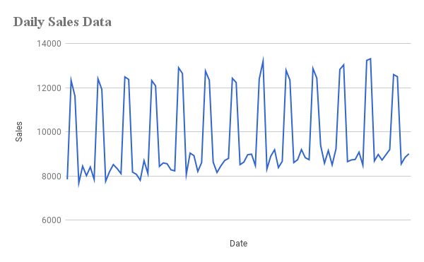
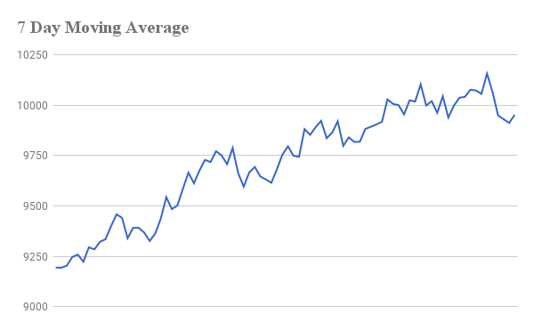
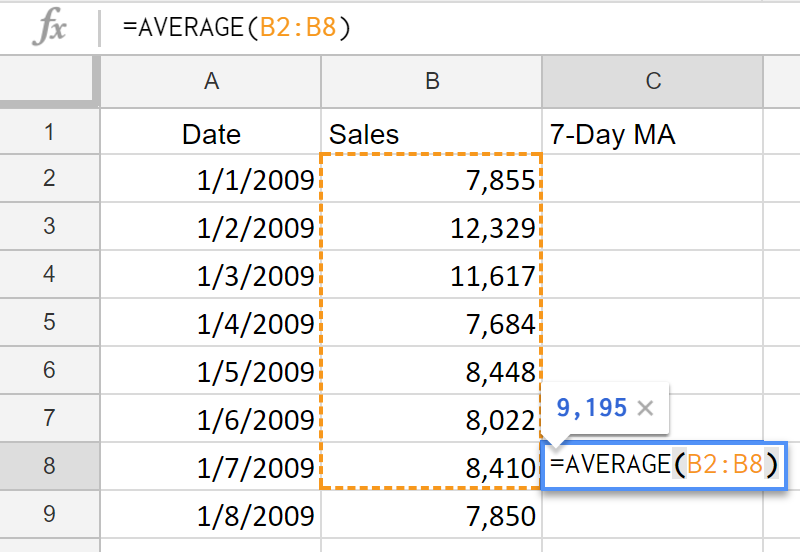

# 移动平均值

移动平均值通常应用于基于时间序列的数据规整，用来描述数据的整体趋势。

移动平均值曲线是在原有数据基础上，通过滚动求值特定期数的平均值，生成的一条预测曲线，它的主要特征是看上去相对平滑，忽略了短期的数据波动。

## 移动平均值的应用

移动平均值曲线因其求值方式，曲线会相对平滑，相比原始数据能更好得反应长期趋势。

我们来看下课程第48节的例子，下图呈现了一组关于时间和销售数据的关系。

很明显，销售数据随着日期成周期性变化，短周期内有较大波动。

如果我们想观察其长期表现，则可以通过移动平均值曲线。

## 计算简单移动平均值

* 设定固定期数间隔

期数的选取通常基于经验：期数选的越长，意味着当期的移动平均值会纳入更多的远期数据；期数选的越短，意味着计算结果更多考虑近期的影响。

如果数据本身具有强周期，比如销售数据（7天），我们可以用它作为期数。

* 基于 Excel 表格的简单移动平均值计算

下图以期数为7为例：

1. 首先选取头部第7天的数据，计算包含该天在内的7天销售数据平均值。
2. 然后选取第8天的数据，再计算包含该天在内的7天销售数据平均值。
3. 依此类推，直到表格最后一行数据。

当然，更简便的方法是，在计算完第一个移动平均值之后，鼠标停在该计算结果单元格右下角，看见小十字后，双击填充（或者下拉到底）即可。

