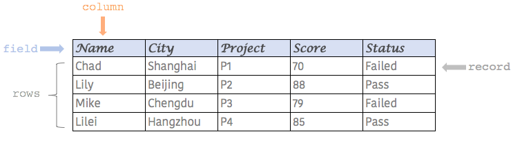
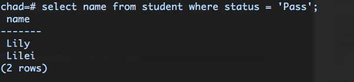
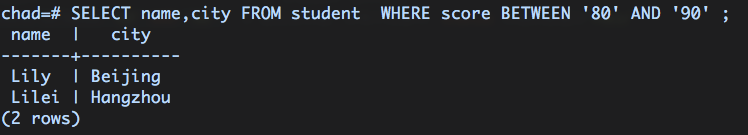
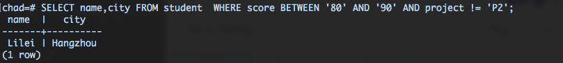
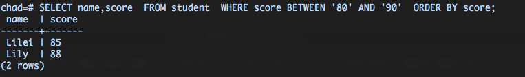
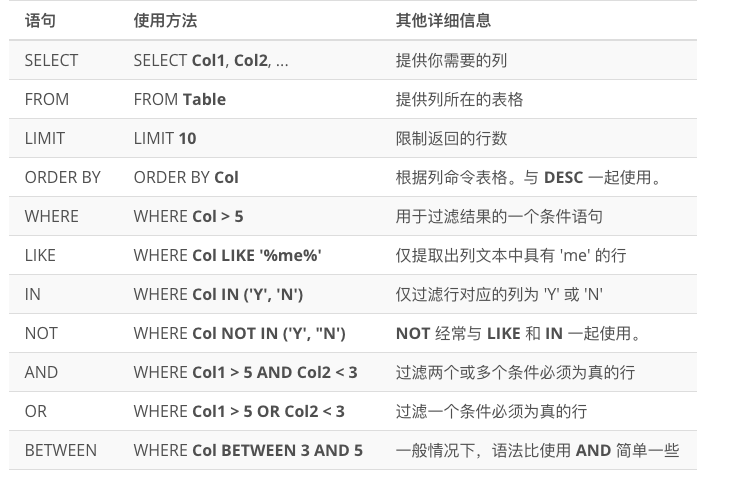

# SQL 基础

## 1. 结构化数据和数据表格

结构化数据指经一定规则组织而成的带有结构性特征的数据，也有人称之为行数据，最常见的形式是表格数据，我们日常使用的 excel 表格就属于结构化的数据。

与之对应的是非结构化数据，比如文档、图片、音频等。

### 1.1 概念约定

  
上图是一个标准的数据表格，结构化的特征体现在以下几个方面：

* **字段**：通常等义于“特征”、“属性”、“参数”，出现在表格数据的第一行，是结构化数据最直接的体现。
* **行**：行数据在具体语境中，通常会被“record”代替，即一条记录。一条行记录涵盖了所有字段的数据，是数据存储的基本单元。
* **列**：列数据是某个字段下所有值，反应的是数据整体在某个字段下的分布情况。

| 名称 | 等义 |
| :--- | :--- |
| 字段 | field, feature, parameter, attribute |
| 行 | row, record |
| 列 | column |

### 1.2 数据库

按照维基百科的定义，这里的数据库特指可供存储、访问的电子数据集合。

数据库分关系型数据库和非关系型数据库，前者我们可以简单得视为一系列表格数据的集合，且表格之间存在关联，反之我们将其称之为非关系型数据库（注意，这里仅做简单的概念区分，详细区别可以参考wiki词条：[NoSQL](https://en.wikipedia.org/wiki/NoSQL)）

### 1.3 数据库查询

涉及数据库知识点有很多，工程角度有专门的ETL（数据的抽取、转换和加载）方向或数据库开发，但作为数据分析师，最基本的技能是数据库查询，从数据源中获得所需数据。  
数据库查询需要遵循特定的语法，与关系型数据库相关的数据查询语言就是所谓的 SQL\(Structured Query Language : 结构化查询语言\)。

## 2. SQL 基础

SQL 的语法非常直观，和自然语言十分接近，我们暂且不用深究其底层运行逻辑，仅从工具应用的角度来看看一段数据查询是怎么样的。

首先，假设数据库中存在如下表格数据，表名为“student”。

| Name | City | Project | Score | Status |
| :--- | :--- | :--- | :--- | :--- |
| Chad | Shanghai | P1 | 70 | Failed |
| Lily | Beijing | P2 | 88 | Pass |
| Mike | Chengdu | P3 | 79 | Failed |
| Lilei | Hangzhou | P4 | 85 | Pass |

SQL 的基本语法结构如下

```sql
SELECT column    # 筛选某一列数据
FROM table_name  # 从某张数据表格中
LIMIT  n         # 限定筛选的数据行数
;
```

按照中文语序，完整的语义就是：从【某个数据表格】中，筛选【某列】的【前n】行数据。

### 2.1 限定语句

从上述 SQL 的基本结构可以看出，`SELECT` 指不加筛选得选中某列数据，而 `LIMIT` 用于限定最终显示的行数，起到过滤或限定的作用，但过滤范围有限，仅仅是行数而已。

那么，如果我们需要精准过滤某些特定条件下的数据该怎么做？

在结构化数据中，我们通过行数据来做过滤。因为一条行记录保有所有字段信息，通过限定该行记录的某字段取值，将不符合条件的行记录排除，剩下的就是所需数据。

在 SQL 中，这样的限定语句，以 `Where` 来引导，后面跟上限定条件即可。  
例如，我们要筛选 Name 这列，且 Status 要为 Pass，我们可以这样写

```sql
SELECT name         # 筛选 name 整列数据
FROM student        # 从 student 表中筛选
WHERE status='Pass' # 限定条件是，所有行记录中，status 字段的取值为'Pass'
;
```

从表上来看，符合条件的就有 Lily 和 Lilei，返回结果如下

  
  
值得一提的是，SQl 语句的难点主要在于写好筛选逻辑，而筛选逻辑则主要反应在对限定语句的书写，如果还涉及到不同表之间的联合，那么会衍生出更加复杂、多变的 SQL 结构，这会在 P3 的课程中涉及。

我们再来看几个筛选逻辑。

* 筛选 name 和 city 列数据，且 score 在 80-90 之间

```sql
SELECT name,city                    # 筛选 name,city 两列数据
FROM student                        # 从 student 表中筛选
WHERE score BETWEEN '80' AND '90'   # 限定条件是，所有行记录中，score 字段的取值在 '80'和'90'之间
;
```



* 筛选 name 和 city 列数据，且 score 在 80-90 之间，且 Project 不等于 P2

```sql
SELECT name,city                    # 筛选 name,city 两列数据
FROM student                        # 从 student 表中筛选
WHERE score BETWEEN '80' AND '90'   # 限定条件1: 所有行记录中，score 字段的取值在 '80'和'90'之间
      AND project != 'P2'                 # 限定条件2: 所有行记录中，project 字段的取值在 不等于 'P2'
;
```



更多关于限定语句的逻辑表达可以查看第47节罗列的内容。

## 2.2 排序

当我们筛选所需数据之后，如果有排序需求的，可以使用`ORDER BY`语句。

**注意**，这里的排序仍然是针对列数据的，且默认的升序，也即当排序的对象是文本时，按首字母升序。如果是数值，则按大小升序。

如果要降序排列，则使用 `ORDER BY DESC`

```sql
SELECT name,score                   # 筛选 name,score 两列数据
FROM student                        # 从 student 表中筛选
WHERE score BETWEEN '80' AND '90'   # 限定条件: 所有行记录中，score 字段的取值在 '80'和'90'之间
ORDER BY score                      # 结果根据 score 升序排列
;
```

结果如下



## 2.3 语序及关键词

虽然 SQL 语句表面上与自然语言十分接近，但毕竟受到底层逻辑的约束，是要根据一定顺序及特定的关键词来解析代码，它的基本语序如下:

```sql
SELECT 
FROM
WHERE
ORDER BY
LIMIT
```

至于什么是关键词，我们可以将它们视为 SQL 中有特定用途的操作符，如`SELECT`就是选择列，`WHERE`就是过滤数据，`BETWEEN AND`就是在过滤的时候限定范围。

除了上述提到的基本关键字之外，Udacity 的课程视频第47节里归纳了一些其他关键词，如下图所示。



**Tips：**  
在 SQL 语句里，除了表格里的具体数据外，是不区分大小写的，也就是说我们写`select`和`SELECT`是没有区别的。但是，为了方便阅读和区分，我们通常将 SQL 里的关键词写成大写，希望大家一开始就能养成这样的习惯。

另外，大家可能注意到上面例题中，筛选 score 字段的时候，数值上加了引号，是因为我在录入数据库的时候，将数值设置成了字符的格式，所以筛选时，将它视为字符，并加了引号。

