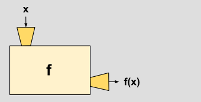

# 函数

人类受限于工作记忆（[working memory](http://en.wikipedia.org/wiki/Working_memory) ），只能处理有限信息[组块](https://en.wikipedia.org/wiki/Chunking_%28psychology%29)。心理学家的研究表明，大多数人只能处理[7个非相关组块信息](http://en.wikipedia.org/wiki/The_Magical_Number_Seven,_Plus_or_Minus_Two)，而计算机则没有这方面限制。

  
计算机的这方面特性，使得可以记忆和处理跨度成千上万行代码。人们为了便于处理这种复杂度，通过计算机语言人为得将其模块化，聚合具备特定功能的代码，抽象成**函数**。

  
以下是一个函数的基本图示，从过程来看，分三个阶段： 1. 输入一个数据 `x` 2. 函数体`f`处理数据`x` 3. 产出结果



## 1. 定义函数

按照上面图示，我们来看一下程序语言里如何来定义函数。

```python
def NAME( LIST OF PARAMETERS ):
    STATEMENTS
```

看一个具体实例

```python
def abs(x):
    if x >= 0:
        return x
    else:
        return -x
```

`def`是`define`的缩写，`NAME`为函数名，可任意命名，通常我们根据其功能来命名。图示中的`x`指输入的数据，称为参数。通过函数体内的操作流程，最终产出`return`一个结果。

## 2. 调用函数

当我们定义完函数后，只有通过调用才能发挥其功能。

```python
>>> abs(-1)  # 调用函数，并输入参数 -1
>>> 1        # 经函数体内计算，直接返回计算结果
```

我们不仅可以单独调用函数，还可以在其他函数体内调用其他函数。

如果我们要实现下面这样的计算过程，可以通过调用函数来达成。   
f\(x,y\)=3x+\|y\|

```python
def abs(x):         # 定义一个计算绝对值的函数
    if x >= 0:
        return x
    else:
        return -x

def my_fun(x,y):   # 预设两个参数 x,y   
    z=3x+abs(y)    # 在该函数内引用之前定义的 abs 函数，并传入参数y
    return z
```

函数间的相互调用或传递让我们无需就某一个复杂功能编辑过于冗长的代码，将一个复杂函数拆分多个子函数即可以便于阅读，也方便维护。

## 3. 函数的参数

上面的例子中，调用`my_fun(x,y)`函数时，必须传入相对应的两个参数。这种数量和位置已经事先规定好的参数类型称为位置参数。Python 中，除了这类参数，还有默认参数、可变参数和关键字参数。

### 3.1 默认参数

默认参数是事先定义好具体值的一类参数，在调用函数时，我们无需再传入默认参数。

```python
def student(name,score,p='P2'):
    print('Name:{};Score:{};Project:{}'.format(name,score,p))
```

上面例子中，共有三个参数，`name, score`和`p`，参数`p`被默认赋值了`P2`，在调用`student()`函数时，`p`无需手动传入。

```python
student('Bob',92) # 只传入两个参数, name 和 score
>>> Name:Bob;Score:92;Project:P2 # 返回的结果会自动带上默认参数p的处理结果
```

### 3.2 可变参数

有时候我们定义一个函数，不想限制其参数的数量，这时就会用到可变参数，可变参数用`*`引导。

下面我们定义一个函数，可以将传入的参数求和。

```python
def my_fun(*numbers):
    sum=0
    for e in numbers:
        sum=sum+e
    return sum
```

`*numbers`表示调用函数时，我们可以传入任意多个参数，比如：

```python
>>> my_fun(1，2，3)    # 调用函数，传入3个数求和
>>> 6                 # 计算结果为6
>>> my_fun(1，2，3,4)  # 调用函数，传入4个数求和
>>> 10                # 计算结果为10
```

### 3.3 关键字参数

可变参数允许你传入0个或任意个参数，这些可变参数在**函数调用**时自动组装为一个tuple。而关键字参数允许你传入0个或任意个含参数名的参数，这些关键字参数在函数内部自动组装为一个dict。

```python
def my_funtion(**kwargs):   
    return (kwargs)


>>> my_funtion(a=1,b=2)  # 手动传入“键-值”对，会被自动组装成一个字典
>>> {'a': 1, 'b': 2}      # 结果返回一个字典


def student(name, age, **kwargs):
    print('Name:',name, '\nAge:', age, '\nOther:', kwargs)

>>> student('Bob',25,score=94,gender='male',city='Shanghai')
>>> Name: Bob 
    Age: 25 
    Other: {'score': 94, 'gender': 'male', 'city': 'Shanghai'}
```

关键字参数可以扩展函数的功能。比如，在`student()`函数里，我们保证能接收到`name`和`age`这两个参数，但是，如果调用者愿意提供更多的参数，我们也能收到。试想你正在做一个用户注册的功能，除了用户名和年龄是必填项外，其他都是可选项，利用关键字参数来定义这个函数就能满足注册的需求。（摘自[廖雪峰 python 3 关键字参数](https://www.liaoxuefeng.com/wiki/0014316089557264a6b348958f449949df42a6d3a2e542c000/001431752945034eb82ac80a3e64b9bb4929b16eeed1eb9000)）

