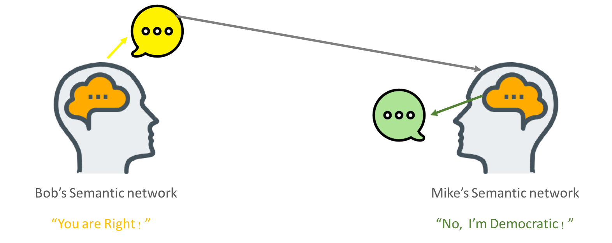
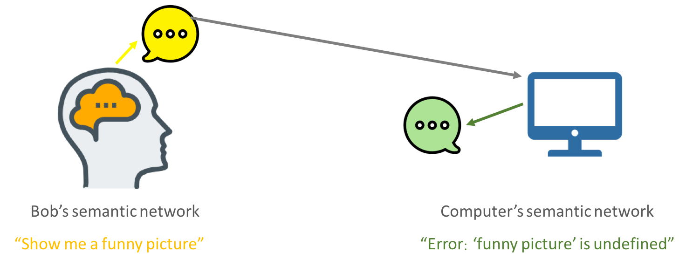

# 自然语言与程序语言

Python 是一种计算机编程语言，用来控制计算机执行任务，与我们日常使用的自然语言不同，但在语词和结构上又有类似，我们先来简单做个区分。

## 1. 自然语言及特性

  
下图是人类语言模型的一个简单抽象： 1. 左侧 Bob 是一个交流的发起者，说话时，将与其意图相关的语义网络（semantic network）以言语（speech）的形式向右侧的 Mike 发布。 2. 右侧的 Mike 接收到 Bob 的 speech 后，匹配到自身的语义网络上，解析该 speech，然后触发回应。



自然语言的上述流程中，涉及到两次转义过程，Bob 从意图到表达和 Mike 的解析。这些转义存在于每一个体头脑中，它们在不同个体之间、在同一个体的不同时刻之间，都可以是不同的，自然语言的这一特性，[被称为（空间维度上的）歧义和（时间维度上的）语义漂变](http://headsalon.org/archives/5521.html)。

## 2. 程序语言

下面我们来看一下程序语言有什么不同。   
对于程序语言来说，计算机的语义系统是提前写好了的，它的语义系统对任何人或其他计算机开放，一个语词或关键字都已经被准确定义，也就不存在歧义和语义漂变了。   
然而，人们并不总满意于一个含义有限的语义系统，实际的需求让我们有源源不断的动力去扩充它。比如下图展示的例子，在原有的计算机语义系统里，并没有关于`funny picture`的定义，于是计算机抛出了一个报错，告诉我们`Error: ‘funny picture’ is undefined`。因此，当我们与计算机交互时，总会做一些声明，人为输入扩充其语义系统，这样的声明（或约定）就是我们常说的**变量赋值**。

```python
# python 里我们以下面的方式给变量赋值，
# pandas.read_csv('picture.csv') 表示从一个 csv 文件中读取内容
funny_picture=pandas.read_csv('picture.csv')
```

通过以上的定义过程，我们就人为得为计算机扩展了其语义系统。



## 3. 程序的编写与执行

程序的编写和执行是两个不同的过程，前者是人类编写，后者是机器执行。我们都听说过这样的话，“计算机世界里只有0和1”，但是我们编写的程序却使用了大量单词。从单词到“0/1”，涉及了非常复杂的编译过程。值得庆幸的是，我们并不需要学习这个编译过程，要做的只是编写符合规范的程序，计算机会自动将我们的程序编译成“0/1”，并执行具体的计算任务。

  
因此，我们所面对的程序语言是经过高度抽象化后的语义系统，这个系统有它自己的编码规范，我们学习一门程序语言的第一步就是学习它的表达规范，即**语法**。

