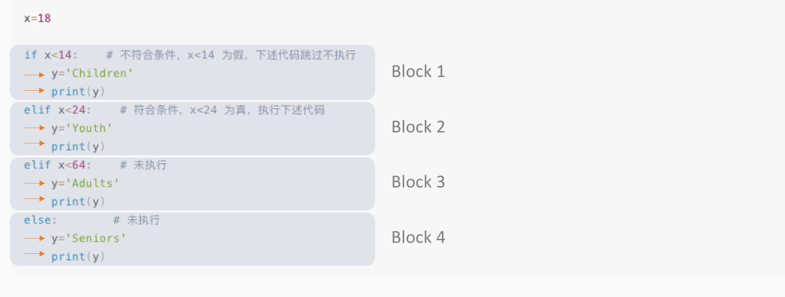
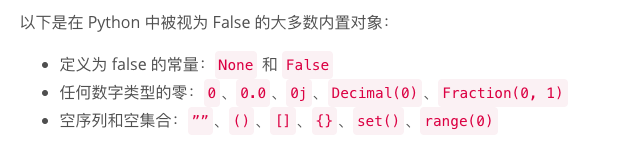

# 条件判断

## 1. 代码块和缩进

简单语句间的逻辑连接会形成多层次的结构化代码块，在 Python 里，这种多层次的代码块通过缩进（一个 tab 键）标识。我们来看一个例子：

```python
if True:
    print('Continue !')
```

这是个简单的判断语句，含义可以表示为“如果...就...”。 **如果**（`if`）后面语句为`True`，**就**执行下方语句，这样一个执行逻辑就是一个完整的代码块。它有两个标识，冒号`:`和 `print`前面的 缩进（一个 tab ）。冒号引领一个结构，缩进展示其内部层次。

## 2. 条件判断

我们来看一个完整的条件判断结构：

```python
if <条件判断1>:
    <执行1>
elif <条件判断2>:
    <执行2>
elif <条件判断3>:
    <执行3>
else:
    <执行4>
```

计算遇到这样一个包含多个条件分支的判断语句，会从头到尾检查条件是否成立，一旦成立就执行相应语句，然后结束所有代码执行。如果没有条件分支满足条件，就执行`else`下的语句。这样一整串的代码，我们可以分拆出四个`Block`，每个`Block`内又可以包含多个执行语句，如下面例子。

 计算机内的执行顺序如下： 1. 声明一个变量，令其等于（指向）18。 2. 执行`Block 1`,检查第一个`if`语句，`x<14`为`False`,于是代码块内的执行语句\(橙色箭头\)会被跳过不执行。 3. 执行`Block 2`,检查第一个`elif`语句，`x<24`为`True`，于是执行代码块内的语句，`y='Youth'`和`print(y)`。 4. 因为`Block 2`已经顺利执行完毕，`Block 3`和`Block 4`会被跳过，不会被执行。

## 3. 非布尔类型的条件判断

有时候，`if`后面跟的不一定是布尔值类型，也可以是任意一个变量`x`。这个时候，只要`x`不是空的（或其他被视为`False`的对象），都会被判定为`True`。

课程3&gt;&gt;控制流&gt;&gt;第5节的一个例子：

```python
errors = 3
if errors:
    print("You have {} errors to fix!".format(errors))
else:
    print("No errors to fix!")
>>> 'You have 3 errors to fix!' # 输出结果
```

上例中，`if`后面的`errors`本身不是布尔值，仅是一个普通的字符串，只要变量`errors`不为空或`0`，它在`if`后面都会表示True。

```python
errors = 0
if errors:
    print("You have {} errors to fix!".format(errors))
else:
    print("No errors to fix!")
>>> 'No errors to fix!' # 输出结果
```

一旦`error=0`,那么用在`if`后面的条件判断时，会被视为`False`，这是 Python 内部约定俗成的规则，简单记忆即可。其他可以被视为`False`的变量如下。



