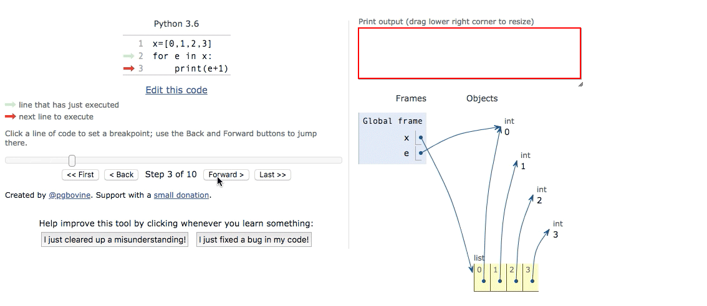

# 循环

我们通过循环让计算机执行重复性任务，Python 里有两类循环：`for`循环和`while`循环。

## 1. `for` 循环

`for`循环通常用于枚举一个对象内的所有元素，形式如下：

```python
for LOOP_VARIABLE in SEQUENCE:
    STATEMENTS
```

表示依次从某一个序列（sequence）中取出元素（LOOP\_VARIABLE）后，执行相应操作（STATEMENTS）。 我们以列表为例：

```python
x=[0,1,2,3]
for e in x:
    print(e+1)

>>> 1  # 第一次循环结果
>>> 2  # 第二次循环结果
>>> 3  # 第三次循环结果
>>> 4  # 第四次循环结果
```

可视化结果： 

前面提过，列表可以视为一个容器，容器内的元素有序排列。`for`循环在列表中的使用就是逐个从容器内取出元素，直到取完所有元素。而`e`是我们逐个取出时定义的变量名，当然你可以取任何名字。 

### `for`循环与条件判断

`for`循环只是从序列中取出元素，取出后具体如何操作还要看具体的执行语句，在`for`结构的代码块内，可以通过条件判断来筛选元素，我们来看一个例子（课程3&gt;&gt;第10节&gt;&gt;标记计数器）。

```python
tokens = ['<greeting>', 'Hello World!', '</greeting>']
count = 0

for token in tokens:
    if token[0] == '<' and token[-1] == '>':
        count += 1

print(count)
```

**执行流程：** 1. 定义两个变量，`tokens`为列表，`count`为数值； 2. 第一次`for`循环，取出列表内的第一个字符串`'<greeting>'`，使用`if`语句判断条件`token[0] == '<' and token[-1] == '>'`为`True`，于是执行`count+=1`，此时`count`的值为1; 3. 第二次`for`循环，取出列表内的第二个字符串`'Hello World!'`,不符合`if`判定条件，跳过下方执行语句； 4. 第三次`for`循环，取出列表内的第三个字符串`'</greeting>'`，符合`if`语句判定条件，于是执行`count+=1`，此时`count`的值变为2; 5. `for`代码块全部执行完毕，最后执行`pring(count)`,结果为2。

## 2. `while`循环

`while`循环不同于`for`循环，不事先从容器内取出元素。它的含义是只要`while`后的条件为`True`，就循环执行，基本形式如下。

```python
while BOOLEAN_EXPRESSION:
    STATEMENTS
```

来看个实例：

```python
n=0
while n<3:
    n=n+1
    print(n)

>>> 1
>>> 2
>>> 3
```

**执行流程：** 1. 定义变量 `n=0`； 2. 进入`while`循环代码块，执行第一次循环，判断条件`n<3`为`True`，执行下方语句，`n`的值变为1； 3. 回到`while` 头部，执行第二次循环，判断条件`n<3`为`True`，执行下方语句，`n`的值变为2； 4. 回到`while` 头部，执行第三次循环，判断条件`n<3`为`True`，执行下方语句，`n`的值变为3； 5. 回到`while` 头部，执行第四次循环，判断条件`n<3`为`False`，不执行下方语句，**跳出循环**。

### `break`与`continue`

`break`提供了一个提前**终止所有循环**的途径，而`continue`表示**终止当次循环**，进入下一次循环。比如：

```python
# break
n = 1
while n <= 100:
    if n > 10: # 当n = 11时，条件满足，执行break语句
        break # break语句会结束所有循环
    print(n)
    n = n + 1
print('END')

# continue
n = 0
while n < 10:
    n = n + 1
    if n % 2 == 0: # 如果n是偶数，执行continue语句
        continue # continue语句终止当次循环，后续的print语句不会执行，回到头部while。
    print(n)
```

**说明：**   
`break`和`continue`是两个终止循环的方法，但不建议大家频繁使用，滥用这两个语句可能会造成代码逻辑分叉过多，容易出错，增加维护成本。我们通常可以通过改写代码逻辑，达到同样的目的，请大家思考上述例子如何改写，避免`bread`和`continue`。

