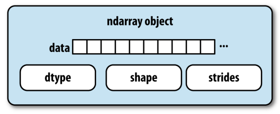
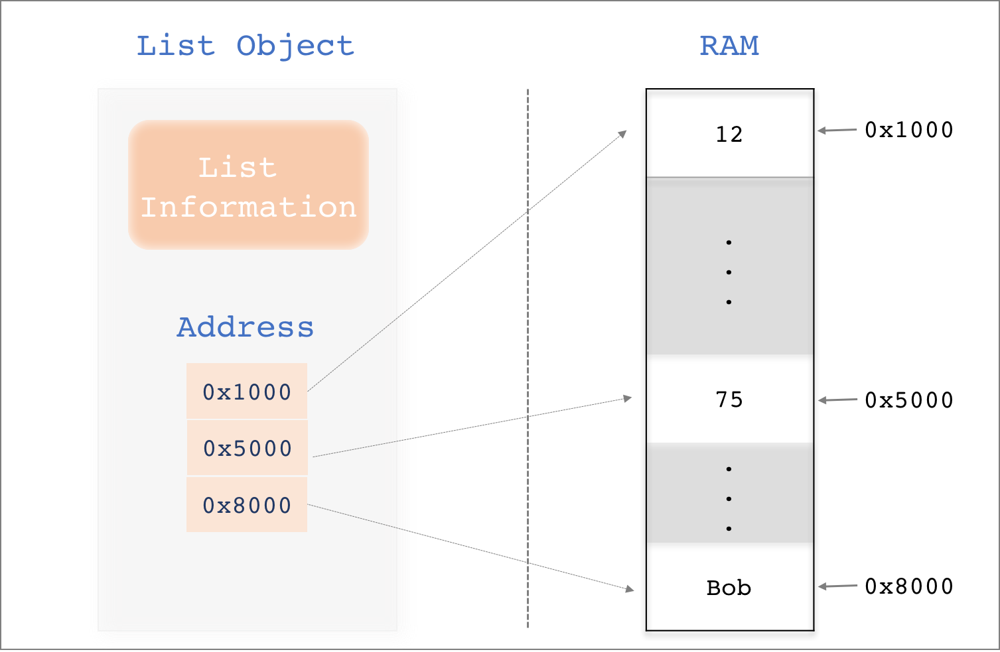
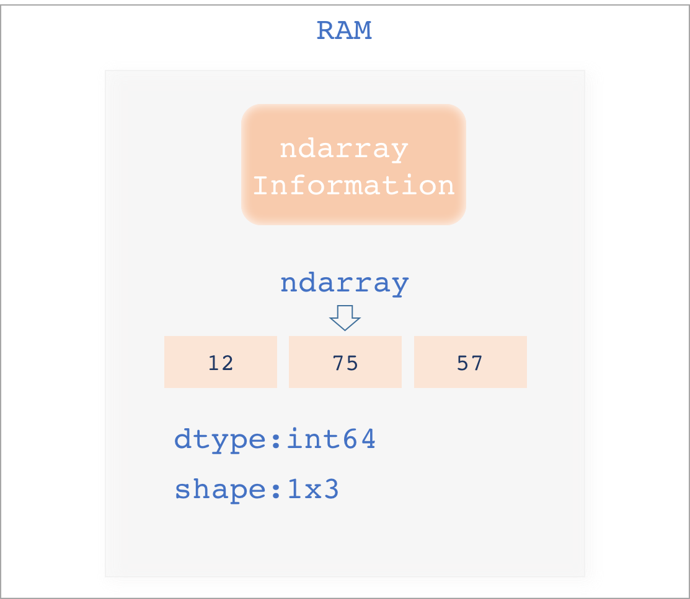
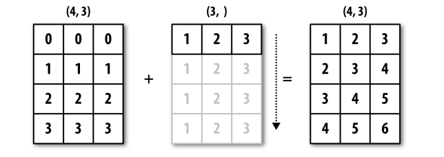
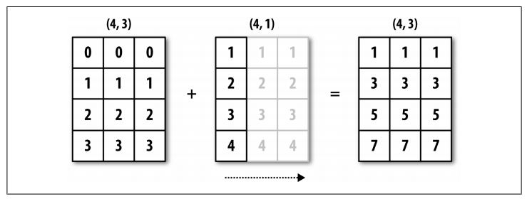

# Numpy

在数据科学领域，Python 无疑是当今最热门的编程语言。除了相对简易的语法，大量功能强大的科学计算模块是成就它今天地位的关键因素。

  
Python 在数据计算方面的优势并不是因为它一开始就以此为目的而设计，早期的 Python 并不擅长计算，但它吸引了一批科学家和工程师为它定义了一系列基于数组运算的软件包，Python 的创始人 [Guido van Rossum](https://en.wikipedia.org/wiki/Guido_van_Rossum) 也欣喜得将部分扩展整合进了 Python 语法中。经过十多年的发展，_Numeric_ 和 _Numarray_ 之类各具所长的数组或矩阵运算包先后诞生，并被整合进了于2006年正式发行的 _Numpy 1.0_ 。Numpy 的正式发行，大大增强了 Python 的计算能力，同时，在 Numpy 基础上结出的一系列丰硕果实又进一步提升了 Python 在数据科学领域的地位。

## Numpy 基础

由于 Python 本身并不善于做数组和矩阵计算，Numpy 的出现让 Python 在这方面的能力大大提高，这种提高主要体现在两个方面：内存占用和时间效率。

## 1. Why Numpy？

## 时间效率

  
我们先来看一下用 Python 的自带函数和 通过 Numpy 对1千万个数值进行排序的时间对比。

```python
import numpy as np  # 导入 numpy，简化名为为 np
import time    # 时间模块

# 通过 Numpy 生成1千万个随机数组
np_array=np.random.randint(1, 10000000, size=10000000)

# 生成一个列表
py_list=list(np_array)

# 使用 Numpy 排序
start=time.time()
np.sort(np_array)    # numpy 的排序函数
end=time.time()
print('time:{}'.format(end-start))

>>> time:1.4582147598266602  # 时间花费1.45秒


# 使用 Python 自带的列表排序方法
start=time.time()
py_list.sort()    # python 的列表排序
end=time.time()
print('time:{}'.format(end-start))

>>> time:16.479313135147095 # 时间花费16.47秒
```

可以看到，两者的时间差异是巨大的，这还只是1千万个，经测试，Numpy 对1亿个数值的排序也不过20多秒，而 Python 自带的排序则远远超过十倍时间。

  
Numpy 如此高效的核心是其内部定义的 _ndarray_ \(多维数组\) 对象，下图是一个 _ndarray_ 的基本构造，包含 data, dtype, shape 和 strides 。

data 代表实际数据，如一个个具体的数值。dtype 预先定义了的整个数组的类型，如 `int`,`float`等。预先定义数组的类型让其内部元素变得同质化，当我们执行计算时，计算机便省去了解析数据类型的工作。shape 定义了数据的维度（形状），如 1 x 10（横向排布十个数据）的一维数组和 3 x 4（三行四列）的二维数组。strides 反应数据在内存上的分布关系，它是 Numpy 在性能方面的重要保障，这里不做深入解释，总之很牛逼就是了。



## 内存占用

Numpy 的另一优势在于它的内存占用。我们来比较一下 Python 中 list 和 Numpy 的 ndarray 在内存占用的区别。   
下图是 Python 中的 list 在内存中存储示意。我们首先定义一个列表：

```python
my_list=[12,75,'Bob']
```

实际上，这个赋值行为，在计算机内部关联了三个操作： 1. 生成一个列表对象 ； 2. 在内存的三个地址（`0x1000,0x5000,0x8000`）上生成三个数据，分别是`12,75,'Bob'`； 3. 列表对象中，记录了内存的这三个地址。

_**注：图中的 RAM 表示内存**_

  
这样的存储方式，使得列表实际存储的是内存地址。我们在调用数据时，比如`my_list[0]`，程序内部首先找到该列表的第`1`个元素记录的内存地址，然后映射到内存上的具体数据，最后取出。

  
这样的操作逻辑，在效率上肯定有所损失。同时，存储内存地址又增加了空间耗用。



  
下面，我们来看一下 Numpy 的 ndarray 存储方式。

  
与 list 最大的不同是这里 ndarray 的数据直接写在了内存中，并且没有任何中间过渡，而 list 是通过保存内存地址，来匹配实际数据的。ndarray 这个特性，让它的实际内存占用只体现在具体数据上，当处理千万级别的数据时，两者的差异会变得非常大。 

## 2. ndarray 基础操作

前面提过，Numpy 的核心是 ndarray，通常叫它数组或者多维数组（其实就是 n-dimensional array 的简写），它是直接写在内存上的类似列表的有序数据。

  
Numpy 是很多数据包的计算基础，它上面结出了很多丰硕果实，包括后面将重点学习的 Pandas，以至于在实际应用中，我们通常直接使用诸如 Pandas 之类的包以满足数据处理需求，而对 Numpy 的操作也基本上仅限于基础的操作，比如创建随机数组、模拟概率分布等。

  
因此，这个部分学习 Numpy 的 ndarray 重点并不在于要熟练数组的各种操作，而是重在厘清一些概念，这样有助于体会使用 Pandas 这个工具时享受到的便利，毕竟 Pandas 的皮囊之下，是 Numpy 的血肉。

### 2.1 创建数组

**一维数组** 最常用的创建数组方式是通过`array()`函数，输入一个列表，即可生成一个数组。

```python
arr1=np.array([1,2,3,4,5,6]) # array() 函数生成数组
arr1
>>> array([1, 2, 3, 4, 5, 6]) # 生成的数组前面会有 array 标识

type(arr1)    # 通过type()来看一下数组的类型
>>> numpy.ndarray    # 返回 ndarray 类型

arr1.dtype    # 用 dtype 来看一下数组内元素的类型 
>>> dtype('int64')  # 数组内元素的类型是整数，并且由64bit构成，也就是8个byte


arr.shape  # 我们来看一下这个数组的形状
>>> (6,)  # 表示这是一个一维数组，长度为6
```

**二维数组**

所谓的 `ndarray` 就是多维数组，我们平时用的最多的是二维数组，比如表格数据。多维数组有两种创建方式： 1. 在原有的一维基础上，直接做切分处理 2. 通过输入列表生成

```python
# 1.  在原有的一维基础上，直接做切分处理，通过reshape()函数输入形状即可
arr1=np.array([1,2,3,4,5,6])
arr1.reshap(3,2)  # 将原数组切分成 3x2 矩阵
>>> array([[1, 2],
           [3, 4],
           [5, 6]])

# 2. 输入列表生成
arr2=np.array([[1,2],
               [3,4],
               [5,6]])
arr2
>>> array([[1, 2],
           [3, 4],
           [5, 6]])
```

### 2.2 多个数组间的算术运算

数组间的计算非常奇特，通常是反直觉的，可以分为同形状和不同形状的数组运算。

**相同形状**   
相同形状的运算只要将对应的元素做算术运算即可

```python
arr1=np.array([1,2,3])
arr2=np.array([4,5,6])

arr1+arr2   # 对应位置的元素相加
>>> array([5, 7, 9])    

arr1*arr2  # 对应位置的元素相乘
>>> array([ 4, 10, 18])


# 创建 2x2 的二维数组：arr3
arr3=np.array([[1,2],
               [3,4]])

# 创建 2x2 的二维数组：arr4               
arr4=np.array([[5,6],
               [7,8]])

arr3+arr4
>>> array([[ 6,  8],
           [10, 12]]) # 对应位置的元素相加
```

**不同形状**

不同形状数组间的计算涉及到 Numpy 的一个**重要概念——Broadcasting**（广播）。 先来看三个问题：

```python
arr1= np.array([[0,0,0],
                [1,1,1],
                [2,2,2],
                [3,3,3]])
arr2= np.array([1,2,3])
# 问题1:
# arr1+arr2 等于多少？


arr3=  np.array([1],
                [2],
                [3],
                [4])
# 问题2:         
# arr1+arr3 等于多少？
```

上面三个计算都属于不同形状数组间的算术运算，可以用以下方式（Broadcasting）来处理。   
问题1:   
如下图所示，先将一维的数组向下填充，生成同形状二维数组，再进行计算。 

  
问题2:   
如下图所示，先将 4x1 的数组向右填充，生成同形状二维数组，再进行计算。 

如果是`arr1+1`呢？根据广播的原则，将`1`同时相右和向下填充，就会生成下面这样的二维数组，然后和`arr1`相加即可。

```python
array([1,1,1],
      [1,1,1],
      [1,1,1],
      [1,1,1])
```

## Tips：

这里花了很大的篇幅介绍了 Numpy 的一些特性，虽然我们在实践中大部分时间是通过 Pandas 来做数据处理，但了解 Numpy 的这些特性，尤其是 Broadcasting，对我们后续学习 Pandas 会有很大帮助。但这部分学习也不必拘泥于 Numpy 的具体操作，掌握基本操作也就可以了，后面的 Pandas 才是重点。

