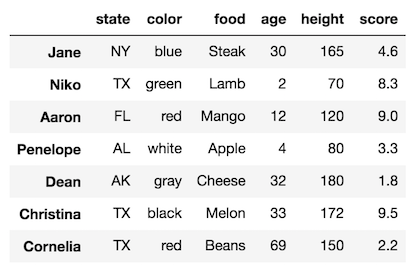
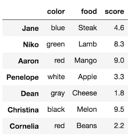

# Pandas Part 1

Pandas 是基于 Numpy 的一种工具应用，主要用于处理表格数据，它几乎是现在数据科学领域的必备工具。Pandas 的广泛应用，几乎让人忘了 Numpy 的存在，甚至有人是跳过 Numpy 直接学习 Pandas的。从应用角度来讲这当然可以，至少仅凭它也完全可以解决实际问题。但如上一节所言，了解 Numpy 的特性，对于我们应用 Pandas 是有极大帮助的，这一节，我们先来着重了解 Pandas **表格数据的结构**和**筛选数据**。

## 1. Pandas 的表格数据

Pandas 有两类数据结构，分别是 `Series`和`DataFrame`。我们先不着急了解`Series`,先来看一下`DataFrame`的具体结构。`DataFrame`就是二维表格数据，可以通过`read_csv()`函数主动读取一个`csv`文件，读取后的表格即是`DataFrame`，但它又与普通的`excel`或`csv`不同，包含了更多隐藏内容，主要结构和概念名称如下图所示。


## DataFrame 的三个主要构成

DataFrame 由三个部分组成，索引，列和数据。数据也称为值\(values\)。

* index: 索引。DataFrame 最左侧的一列数据，读取`csv`时会额外生成，index 的值称为 索引标签，也叫行标签。
* column name：表格的第一行，表示表格数据的列名称，也叫列标签。
* values：除索引和列名称外的所有具体数据，称为值。

另外，axis 表示轴，有横轴和纵轴。axis=1 表示列轴，axis=0 表示行轴。

## 行标签与列标签

每一行和列都有一个标签，对于列来说，最顶上的字段名称`column name`就是它的标签，而行标签则是最左侧的索引`index`。   
两类标签分别可以用来指代行和列信息，这在`DataFrame`的筛选数据过程中会频繁用到。

## 数据读取

我们通过 `read_csv()`函数读取`csv`文件`sample_data.csv`，这里我们额外加一个操作，将数据的第一列设置为索引`index`。

```python
import pandas as pd
import numpy as np
df = pd.read_csv('sample_data.csv', index_col=0) # 将第一列设置为 index
df
```

返回如下数据



**DataFrame 数据信息**

```python
>>> index = df.index  # 提取表格的索引 index
>>> columns = df.columns  # 提取表格的列名称
>>> values = df.values  # 提取表格的数据

>>> index
Index(['Jane', 'Niko', 'Aaron', 'Penelope', 'Dean', 'Christina', 
       'Cornelia'], dtype='object')
>>> columns
Index(['state', 'color', 'food', 'age', 'height', 'score'], 
      dtype='object')
>>> values
array([['NY', 'blue', 'Steak', 30, 165, 4.6],
       ['TX', 'green', 'Lamb', 2, 70, 8.3],
       ['FL', 'red', 'Mango', 12, 120, 9.0],
       ['AL', 'white', 'Apple', 4, 80, 3.3],
       ['AK', 'gray', 'Cheese', 32, 180, 1.8],
       ['TX', 'black', 'Melon', 33, 172, 9.5],
       ['TX', 'red', 'Beans', 69, 150, 2.2]], dtype=object)
```

我们再来看一下，`index,columns,values`的数据类型。

```python
>>> type(index)
pandas.core.indexes.base.Index

>>> type(columns)
pandas.core.indexes.base.Index

>>> type(values)
numpy.ndarray
```

**理解三类数据类型**

有趣的是，我们可以发现 `index`和`columns`其实同属一个类型，这意味着他们在数据表格中的作用相近，我们后面会提到。 而`values`正是我们熟悉的 Numpy 中的`ndarray`类型，至此，我们第一次在 Pandas 中发现了 Numpy 的身影。

## 2. 筛选数据

Pandas 筛选数据方式十分多变，这是初学者最容易混淆的地方，Pandas 语义的多变性让它变得非常灵活，同时也加大了它的学习难度。   
但是筛选方式还是有迹可循的，我们应该永远记住，下列三种方式几乎是可以完成所有筛选任务的，尽管有时会有其他更高效和简洁的筛选方式。

```python
# 方括号筛选
df[ ]

# 索引筛选
df.loc[ ]

# 整数筛选
df.iloc[ ]
```

**方括号筛选: \[ \]**

* 筛选单一列数据

在方括号中输入列名称，如`'food'`。

```python
>>> df['food']
Jane          Steak
Niko           Lamb
Aaron         Mango
Penelope      Apple
Dean         Cheese
Christina     Melon
Cornelia      Beans
Name: food, dtype: object
```

我们再来看一下它的数据类型

```python
>>> type(df['food'])
pandas.core.series.Series
```

`Series`**终于出现了！**

  
也就是说，选择单一的列，最终返回的会是一个`Series`类型，如上面代码`df['food']`返回的数据。 一个`Series`类型的数据有两个主要成分：索引`index`和值`value`。此外还有一个名字`name`，就是列名称`food`

* 筛选多列数据

如果筛选多列数据，只要将列名字组装成一个列表，放在方括号内即可。

```text
>>> df[['color', 'food', 'score']]
```



**注：** 对比单列和多列筛选，我们发现两者的展示形式也不一样。单列筛选的结果`Series`呈现的是文本，而多列筛选的结果仍然是一个表格`DataFrame`。

**索引筛选：**`.loc`

与方括号筛选相反，`.loc`\( location 的缩写\) 针对行进行筛选。

* 单行索引

```python
>>> df.loc['Niko']
state        TX
color     green
food       Lamb
age           2
height       70
score       8.3
Name: Niko, dtype: object


>>> type(df.loc['Niko'])
pandas.core.series.Series
```

返回的结果跟方括号的单列筛选很像，同样是一个`Series`，只不过这的索引 index 变成了列名称，而 name 变成了所选的行名称 Niko。

* 多行索引

```python
>>> df.loc[['Niko', 'Penelope']]
```


结果是一个`DataFrame`，同方括号多列筛选。

**连续选取**

我们知道，Pyhton 的 list 取数的时候，可以用冒号表示取数的起点和终点位置，在 Pandas 中也有类似的用法。

```python
>>> df.loc['Niko':'Christina'] # 连续选取从 Niko 到 Christina 的行数据
>>> df.loc['Dean':]# 连续选取从 Dean 到最末 的行数据
```

**行列同时选取**

行列同时选取，通过`,`区隔

```python
df.loc[row_selection, column_selection] # 逗号左边是行选择，右边是列选择

>>> df.loc[['Dean', 'Cornelia'], ['age', 'state', 'score']]

>>> df.loc[:,:]  # 行和列全部选取，也即所有数据
```


 _****_`.loc`_**总结**_

1. 仅用于行、列标签 \( column names / index \)
2. 可以同时筛选行和列
3. 通过逗号`,`区隔行/列

**整数筛选**

`.iloc`同样也是默认筛选行数据，不过它是通过整数进行筛选。

这里整数容易令人误解，因为有时候索引`index`也可能会是整数 ，个人更喜欢叫它“坐标”，如同经纬一般，指的是行序号和列序。比如，第1行（或列）的序号为0，第二行（或列）的序号为1，依次类推。

`.iloc`和`.loc`用法一样，只不过行列筛选都变成了序号。比如：

```python
>>> df.iloc[3:6, [1, 4]] # 行序号3~5,列序号1和4
```

注意整数连续筛选的时候，最后一个位置不选中。如上面行序号只选了3，4，5三行。


