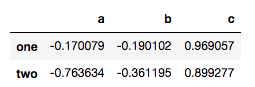
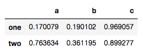
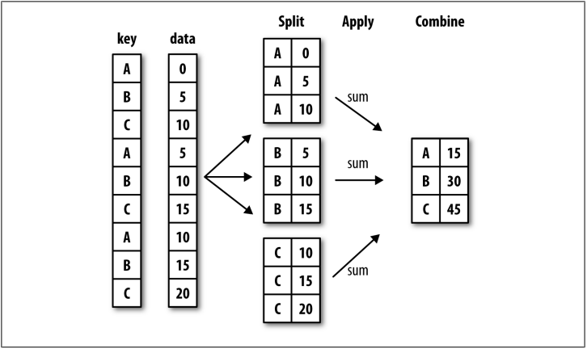
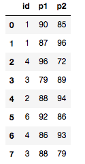
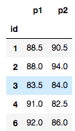
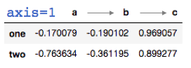
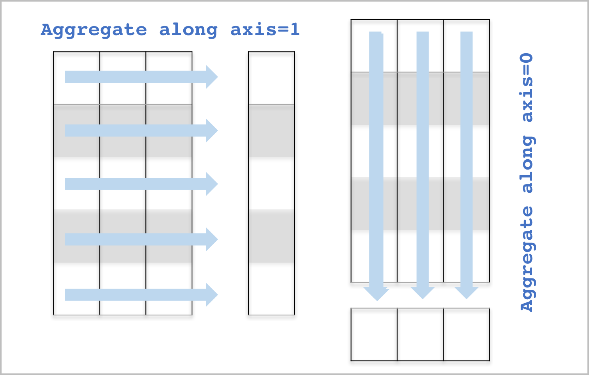

# pandas Part 2

## 常见的函数与方法

Pandas 中的函数非常多，想短时间掌握并不现实，我们只要熟练掌握实践中常见的几个函数即可，而与我们数据分析结合最密切的自然就是与统计相关的函数。

### Aggregation （聚合型）

聚合型函指通常用于对某列或行的汇总统计，如加总、平均值、计数、最大最小值、众数统计等，通常作用于列计算，当然如果有需求，也可以针对行数据。

| 函数 | 说明 |
| :--- | :--- |
| `sum()` | 返回某列的数值加总 |
| `mean()` | 返回某列的平均值 |
| `count()` | 对某列所有值进行计数 |
| `nunique()` | 对某列不相同的值进行计数 |
| `mode()` | 筛选某列出现次数最多的值 |
| `max()` | 筛选某列最大值 |
| `min()` | 筛选某列最小值 |

代码实现是筛选列数据后，加上相应函数即可。

```python
>>> df['column_1'].sum()
473387479.0    # 返回一个具体数值
```

如果要同时计算多个列，在筛选数据时添加多个列。

```python
>>> df[['column_1','column_2']].sum()
column_1      473387479.0       # 分别返回两列的统计结果
column_2      280871787.0
dtype: float64
```

如果针对整个数据表格，即不筛选特定列，它会返回所有列的统计结果。

```python
>>> df.sum()
column_1      473387479.0       # 返回所有列的统计结果
column_2      280871787.0
column_3      247271581.0
dtype: float64
```

整体或者多列统计后，我们也可以再次筛选某一列的统计结果。

```python
>>> df.sum()['column_1']  # 返回所有列的统计结果后，再筛选某一列
column_1      473387479.0
```

## Element-wise Function \( 元素级函数 \)

另一类常见的函数是针对具体元素的，源自 Numpy，直观上有点像 Broadcasting，对一个具体元素执行某个函数，这个函数会扩散到所有元素，比如绝对值函数。

如下面的代码，`abs()`会对`Series`内的每个元素做绝对值处理，这个形式和 Numpy 中的 Broadcasting 很像。

```python
>>> my_series=pd.Series([-1,2,-0.4])
>>> my_series.abs()
0    1.0
1    2.0
2    0.4
dtype: float64
```

再来看一个数据表格的例子

```python
>>> data=np.random.rand(2,3) # random.randn() 函数创建随机正态分布数组

# 结果返回一个 2x3 的二维随机数组
array([[-0.17007948, -0.19010185,  0.96905669],
       [-0.76363388, -0.36119492,  0.89927742]])

# 用二维数组来生成一个表格，手动添加 index 和 column name               
>>> df=pd.DataFrame(np.random.rand(2,3),index=['one','two'],columns=['a','b','c'])
>>> df
```

返回的表格数据



对表格数据施加`abs()`函数，它会对所有元素执行。

```python
>>> df.abs()
```



### 元素级函数的一个重要应用： `apply()`

有时候，我们需要对元素做某类特定计算，但并无内置函数可用，这时候我们需要自己来编写函数，并将它适用到某列中，比如，对每个元素做 `+1` 处理。

```text
# 先定义一个函数，表示当输入一个数据 x 时，对其做 +1 处理
def my_func(x):
    return x+1
```

然后通过`apply()`方法，将这个函数应用到某列的所有元素

```text
>>> df['a']    # 先看下 a 列的具体元素
one   -0.170079
two   -0.763634
Name: a, dtype: float64

>>> df['a'].apply(my_func) # 在该列后使用 apply() 方法，括号中放入我们编好的函数
one    0.829921
two    0.236366
Name: a, dtype: float64
```

这样我们就完成了对所有元素的 +1 处理。

## Groupy 与 Aggregation

关于汇总统计，还有一个方法非常常用，就是分类汇总。比如下图的两列`key`和`data`，如果我想计算所有`A`的汇总怎么操作？ Pandas 提供了一个非常实用的函数`groupby()`,执行逻辑如下。



1. 选取两列或多列数据，确定一个你要分类的字段，比如`key`
2. 将所有相同的`key`分为一组
3. 对分完组的数据`data`施加聚合计算，如`sum()` 
4. 将结果合并返回

注意这里合并后的列`['A','B','C']`就成了索引`index`。

**多列聚合**

我们也可以在分组之后，同时对多个列数据做聚合计算。

```python
# 创建一个字典
data={
      'id':[1,1,4,3,2,6,4,3],
      'p1':[90,87,96,79,88,92,86,88],
      'p2':[85,96,72,89,94,86,93,79]
     }
# 生成一个表格
>>> df=pd.DataFrame(data) 
>>> df
```



在表格的基础上，不加筛选得做平均值计算。它会返回 `p1`和`p2`的聚合计算结果，同时发现，原来的列`id`变成了索引`index`，且返回仍是一个表格`DataFrame`。

```python
df.groupby('id').mean()
```



当然，我们也可以在返回的结果上执行筛选，如`p1`,后面使用方括号筛选即可。

```python
>>> df.groupby('id').mean()['p1']
id
1    88.5
2    88.0
3    83.5
4    91.0
6    92.0
Name: p1, dtype: float64
```

因为只选择了一列数据，返回的是一个`Series`。

## 关于数轴 axis

在 Pandas 第一部分的表格结构中，我们简单解释了 axis,`axis=1` 表示列轴，`axis=0` 表示行轴，我们来看一下它的具体使用。

在本节的所有计算中，都是默认针对列数据的。

```python
>>> data=np.random.rand(2,3) 
>>> df=pd.DataFrame(np.random.rand(2,3),index=['one','two'],columns=['a','b','c'])
>>> df
```


```python
>>> df.mean()
a    0.473749
b    0.379343
c    0.526117
dtype: float64
```

如果让它针对行计算呢？我们只需要添加`axis=1`

```python
>>> df.mean(axis=1)
one    0.522078
two    0.397395
dtype: float64
```



这里有一个非常反直觉的处理，既然`axis=1`是列轴，为什么用来计算行。

实际上，在计算时加入`axis=1`表示沿着列轴方向计算，最终每行都会得到一个对应的计算结果。在 Numpy 里，这样的方式叫做 collapse \(塌缩\)。下面的两组幅图，可以直观得解释沿着`axis=1`和`axis=0`计算后的 collapse 结果。

 

