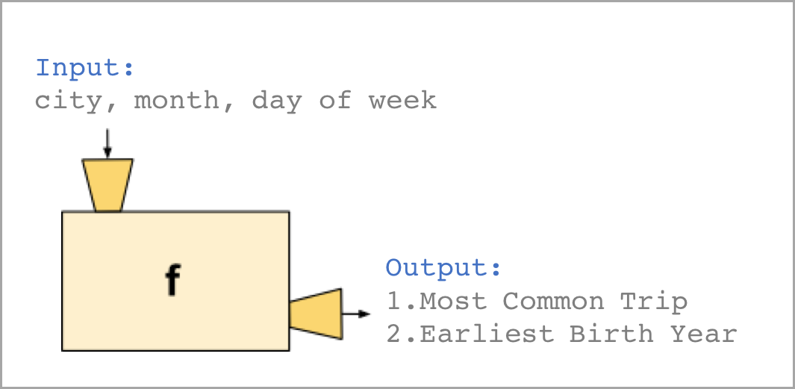

# Project

## 1. 素材准备

进入【项目：探索美国共享单车数据】，点击课程资源，下载 **Bikeshare-New 2**，解压后打开，其中包含三个城市单车数据和一个代码模版 **bikeshare.py**

_下载页面_

_文件内容_

**关于代码模版：**

**bikeshare.py** 是课程提供的 p2 代码模版，里面预先定义了具有特定用途的函数模块和相应注释，我们的任务是**根据函数的功能填写所有运行逻辑**。

**打开方式：**可以在启动 `jupyter notebook`后打开`bikeshare.py`编辑或者用其他代码编辑器（如果你熟悉的话）。

## 2. 任务拆解

我们需要编写一个脚本，当用户输入城市、月份、天时，程序自动在屏幕上打印出该城市的统计数据，比如：哪一段行程最热门及最年轻、年长的用户。

完成这个任务，我们可以像下图这样写一个函数，用来处理所有用户输入，最终返回结果。

但是，这并不是一个理想的操作方式。因为从用户输入到最终产出结果中途会涉及很多任务，比如处理用户输入、导入数据、计算数据等，一个函数同时处理多个任务，会让我们的代码变得冗长，也不方便管理和测试。

正确的做法是将这个复杂任务拆分成多个简单的小任务，就每个小任务编写函数。

我们将任务做如下拆解，分成四个小任务，每个小任务对应一个特定的函数。这样分拆的好处是，特定函数处理特定问题，相互间也可以保持独立。

## 3. 编写函数

_待续_

