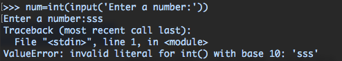

# 程序与交互

用户与程序的交互方式有很多，如语音、视觉、物理触碰等，最简单和基础的方式是用户通过文字输入完成互动。我们可以通过人为改变输入内容，让程序完成不同场景下的任务。

## 1. 用户输入

我们可以使用 Python 的内置函数 `input()` 获取用户的原始输入，运行该函数的结果是，解释器会自动弹出闪烁的光标，提示用户输入内容。同时你也可以在括号内输入提示语，引导用户输入恰当的内容。

```python
name = input("Enter your name: ")  # 提示用户输入名字，将用户输入的内容赋值给变量 name。
print("Hello there, {}!".format(name.title()))
```

### 处理用户输入

### 1.1 数值处理

通过`input()`函数处理的用户输入，都会变成字符串`str`类型，尽管有时候你的本意是输入数值，这种情况，需要通过`float()`或`int()`将它转化为数值型。

```python
age = int(input('Please enter your age:')) # 将输入的数字转成  int 类型
integer=int(float(input('Type a number: '))) # 先将输入的数字转成  float 类型，再将其转成 int 类型
```

### 1.2 字符串处理

我们也可以将输入的字符串作为调用函数时的参数，这样，函数就可以根据不同的输入做相应处理。

```python
# 将用户输入的字符处理成单词首字母大写后赋值给 city
city = input("Would you like to see data for Chicago, New York or Washington ?").title()

# 将用户输入的字符处理成单词首字母大写后赋值给 month
month= input("Whick month would you like to filter? ").title()

# 定义一个函数
def filter(x,y):  
    print('Calculating statistic of {} on {}, please hold on.'.format(x,y))

# 调用函数，以先前的用户输入作为参数，传入函数体内。
filter(names,city)
```

## 2. 容错处理

程序运行过程中，一旦出现错误（比如索引错误、语法错误、类型错误等），程序就会中断并跳出，如果我们希望程序在遇到错误时，跳过并返回错误信息，同时不至于直接中断运行，还能继续运行后面的代码，这时候我们就要做容错处理。

我们看一下没有容错处理的程序是怎么样

```python
num=int(input('Enter a number:'))
square=num**2

print(square)
```

当用户在提示输入一个数字时，输入了一个字符`sss`，由于`int()`函数只能处理数值，所以程序会报错，弹出`ValueError`，导致程序直接终止而不再执行下方所有语句。 

这时候我们可以增加容错处理，当用户输入错误数据时提示他重新输入，直至正确。

```python
while True:
    try:
        num=int(input('Enter a number:'))
        print('Success')
        break
    except:
        print('Error. Try again')
```

**流程如下：** 1. 进入 `while`循环 2. 首先执行`try`下方代码块，如果整个过程没有报错，就打印`Success`，并且执行`break`结束所有循环 3. 如果执行`try`代码块过程中出现错误（当输入一个字符串时），执行`except`代码块，提示`Error. Try again`，回到`while`循环头部 4. 反复执行，直到正确输入

`try/except`语句为程序提供这样一个功能：首先执行`try`部分代码块，一旦出错，就执行`except`部分代码块。

