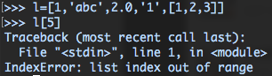
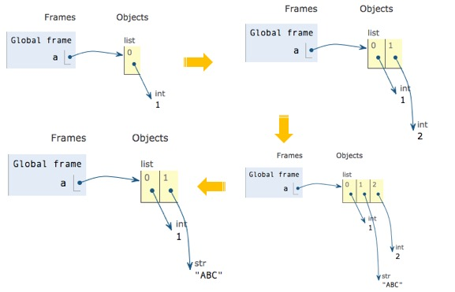

# 列表、元组与字典

列表、元组与字典有一个共同特点，都可以作为一个容器，可以包含多个元素。

## 1. 列表

列表作为一类容器，内部元素按顺序排列，标识为一对方括号`[]`。以下定义了1个列表，包含5个元素。

```python
l=[1,'abc',2.0,'1',[1,2,3]]
```

在容器 `l` 里，我们能看见还有一个列表`[1,2,3]`作为 `l`的元素，当然你也可以构造更为复杂的列表，在一个元素里加入更多类型的数据。

## 列表的基本操作

既然列表内的元素排列是有序的，那么每个元素都会有一个位置标识，我们称它为索引`index`，在计算机里，排序是从`0`开始的，也就是说列表的第一个数对应的索引其实是`0`。

### 1.1 取数

列表里我们通过位置标识\(index索引\)来提取数据。

```python
l=[1,'abc',2.0,'1',[1,2,3]]
l[0]  # 取出第一个元素 1
l[1]  # 取出第二个元素 'abc'
l[0:3]# 取出第1-3个元素 [1, 'abc', 2.0]，取出的是一个列表
l[0:] # 省略第二个位置，就是取完所有元素[1, 'abc', 2.0, '1', [1, 2, 3]]
```

注意，这里的列表`l`只有5个元素，如果我们取到第6个元素，程序就会报错，显示索引超出列表范围的错误。 

### 1.2 列表方法

关于列表的几个常用方法如下

```python
# 创建一个空的列表容器，里面没有任何元素
a=[] 

# 1. 在列表尾部插入元素 1         
a.append(1)

# 2. 再次插入元素 2   
a.append(2)

# 3. 在 索引 1 的位置插入 'ABC'   
a.insert(1, 'ABC') 

# 4. 在列表尾部删除一个元素 
a.pop()
```

上述过程图示如下  更多方法可以查看这个[链接](https://www.w3schools.com/python/python_ref_list.asp)，或者搜索中文关键词“ Python 列表方法”。

## 2. 元组

元组与列表形式上类似，将方括号变成圆括号`()`即是一个元组。   
元组的取数方式和列表一样，但是元组一旦初始化就不能修改，比如我们无法使用`append()`和`pop()`添加/删除元素，也不能改变其中某个元素的取值。

```python
a=[1,2,3]   # 这是一个列表
b=(1,2,3)   # 这是一个元组

a.append(4) # 列表更新为 [1,2,3,4]
b.append(4) # 程序报错
a[0]='abc'  # 列表的第一个元素变更为'abc'
b[0]='abc'  # 程序报错
```

## 3. 字典

Python 内的字典，在其他语言中也有称为映射（map），使用键-值（key-value）存储，用于查询十分方便，其标识为`{}`。任意一个 key，通过字典总能查到其对应的值，且为了保证每次查询一个 key 时，总能得到唯一结果，我们规定字典内的 key 不可重复。   
下面，我们尝试将一个表格里的行记录\(不包含字段名\)写成字典的形式。

### 3.1 查询与变更

table\_1

| name | score |
| :--- | :--- |
| Bob | 93 |
| Mike | 87 |
| Lily | 83 |

```python
table_1={
        'Bob':93,
        'Mike':87,
        'Lily':83
        }

table_1['Bob']   # 查询 'Bob'的值：93

table_1['Chad']=88 # 添加一组新的 key-value，此时原字典扩展到 4对 key-value

table_1['Bob']=98 # 将 'Bob' 对应的 value 变成98
```

如果行信息有较多字段，我们可将数据以列表的形式存到 value 中。   
table\_2

| name | score | status |
| :--- | :--- | :--- |
| Bob | 93 | Pass |
| Mike | 87 | Failed |
| Lily | 83 | Failed |

```python
table_2={
        'Bob':[93,'Pass'],
        'Mike':[87,'Failed'],
        'Lily':[83,'Failed']
        }
```

### 3.2 字典方法

以 table\_1 为例

```python
table_1={
        'Bob':93,
        'Mike':87,
        'Lily':83
        }

table_1.keys() # 返回包含字典所有 key 的列表
>>> dict_keys(['Bob', 'Mike', 'Lily']) # 返回结果

table_1.values() # 返回包含字典所有 value 的列表
>>> dict_values([93, 87, 83])

table_1.items() # 将每对 key-value 生成元组，3对元组合成一个列表
>>> dict_items([('Bob', 93), ('Mike', 87), ('Lily', 83)])
```

更多方法可以查看这个[链接](https://www.w3schools.com/python/python_ref_dictionary.asp),或者搜索中文关键词“Pyhton 字典方法”。

