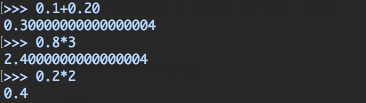
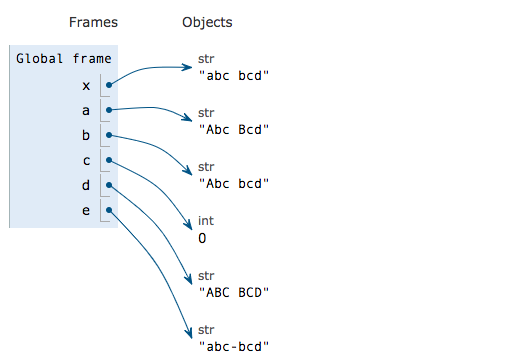
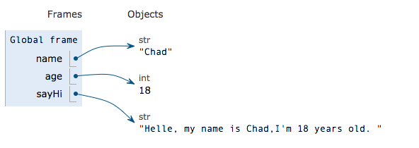

# 数值与字符串

## 1. 数值

数值类型根据是否整数分为整数和浮点数，对应到 Python 里的类型是 `int`和`float`。数值类型的特点是可以进行算术运算，相对好理解，这里不做过多介绍。   
这里提一下 `float`类型，有时候在计算时可能会遇到的一些奇怪问题，比如：



这样的结果，是因为浮点数在计算机中实际是以二进制保存的。 有些小数比如0.1，是十进制，转化为二进制后它是个无限循环的数`0.00011001100110011001100110011001100...`

## 2. 字符串

字符串就是文本信息，特征是被单引号 '' 或双引号 "" 括起来，比如`'123'`和`'ABC'`。   
字符串与数值一样，是数据处理的基本对象。但我们对字符串操作的实际需求对比数值有很大不同，数值类型我们能想到的就是算术运算，字符串却不同，这些需求包括但不限于：文本翻转、大小写转换、字符计数、字符拼接等等。

### 2.1 字符串方法

针对这些需求，如果我们每次都要花时间自己写一遍实现程序，那无疑是十分低效的，所以 Python 内置了一些特定函数或方法来帮我们自动处理常见需求。   
 我们来看一些常见的字符串方法：

```python
x='abc bcd'   # 首先声明一个变量 x

# 将 x 内的单词首字母变成大写
a=x.title()  

# 将 x 的第一个字母变成大写
b=x.capitalize()

# 在 x 中找到 'abc'，并返回位置
c=x.find('abc')

# 将 x 的所有字母转成大写
d=x.upper()

# 将 x 中的空格转成短横杠
e=x.replace(' ','-')
```

可视化结果如下

 更多方法可以查看这个[链接](https://www.w3schools.com/python/python_ref_string.asp)，或是[官方文档](https://docs.python.org/3.6/library/string.html)，或者搜索中文关键词“ Python 字符串方法”。

### 2.2 格式化

我们先来看一个例子

```python
Name = 'Chad'
Age = 18
```

我们首先定义两个变量，`Name`和`Age`。这时如果我们要输出一段文字`Hello, my name is Chad,I'm 18 years old.`该怎么写。   
如果引用变量的话，第一时间想到的是这样写：`“Hello, my name is Name,I'm Age years old.“`   
但是这里有一个问题，在一个字符串里面引用变量，因为其被外面引号包裹，变量名本身会被视为字符的一部分，所以它的输出仍然是：`“Hello, my name is Name,I'm Age years old.“`，不会将`Name`和`Age`的具体值带入。   
我们的处理方式是将`Name`和`Age`格式化，使用`format()`方法，让它们不受其外面的引号影响，而真正发挥变量指向某个具体值的作用。实现方式如下：

```python
name='Chad'
age=18

# 我们将变量的位置空出，用 {} 代替，同时在 format() 的括号里按顺序填入 name，age 
sayHi='Hello, my name is {},I\'m {} years old '.format(name,age)
```



字符串格式化方法会经常用到，包括 P2 项目里，是一个必备技巧，熟练掌握这个方法最好从认识它解决了什么问题出发（在字符串内输出变量指向的值）。   
格式的方式有多个，以上介绍的方式比较直观，建议以此为准。

