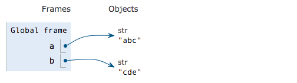

# 变量

在前述“自然语言与程序语言”一节中，我们引出了变量的概念，当我们想要扩充计算机的语义系统前，需要提前声明一个变量，并对变量的内容（也就是“值”）做好约定。

  
 关于变量，还有另外一个可见的作用：方便引用。它就像自然语言里的代词“他、她、它”一样，我们无需完整得说出一个人的姓名，通过指代也能达到指向的目的。

```python
pi=3.1415926
r=1.6667

area1=3.1415926*1.6666667*1.6666667
area2=pi*r*r            # 通过指代，直接引用数据
```

## 变量赋值

在上面例子，我们令`pi=3.1415926`就是对`pi`赋值，是一个从无到有的过程。“赋值“这个词是一个生造词，对于刚接触编程的同学可能难以有相应的经验基础在直觉层面理解它，但是换一个词，大家就好理解了，就是“指向- point to "。那么，相应的`=`号作为其含义也就变成了 `->`。

```python
pi -> 3.1415926
```

我们想象有一枚指针与变量`pi`相连，指向某个数据（数值、文本或其他类型），只要我们乐意，可以随时让指针调转方向，指向其他数据，这样的行为很常见，也就是对变量的多次赋值（让指针调转方向）。

我们来看一个例子，看计算机内部怎么实现一个变量的多次赋值。

```python
a='abc'
b='cde'
```



```python
a=b
print(a)  # 可以看出 a 指向了 b 的值 ‘cde’
```


