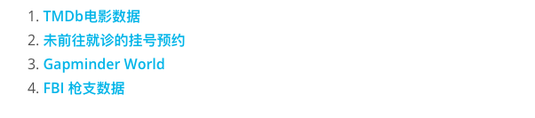
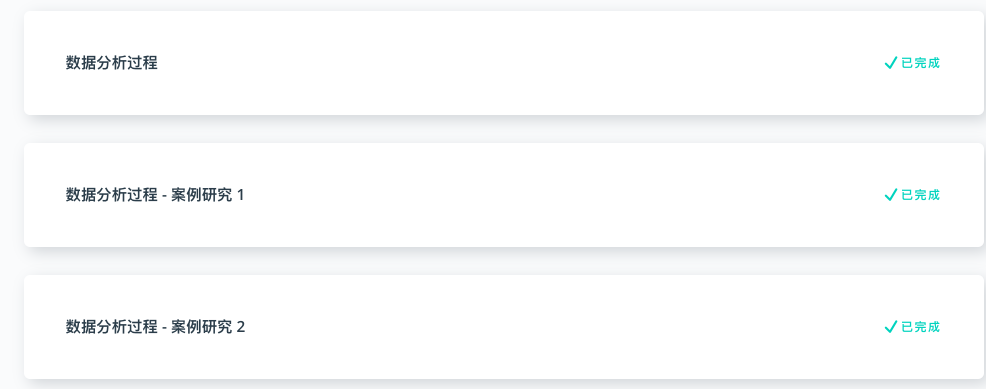

# P3

## 1. 项目介绍

P3 项目实战中，你们会拿到四个可选数据集，任选其一，使用数据分析包（Numpy/Pandas）探索数据，并以可视化方式呈现分析结果。

该项目没有标准答案，需要大家自己设置问题，通过数据处理和分析给出可视化结论。

_数据集_

## 2. 能力要求

1. 使用 Pandas 处理、分析表格数据
2. 使用 Matplotlib 绘图

## 3. 导学建议

P3 阶段重点学习 Pandas 处理和分析表格数据，这部分内容大多是对 [P2 Pandas Part 1](../p2/pandas-part-1.md) 和 [P2 Pandas Part 2](../p2/pandas.md) 的延伸。此外，我们还会着重学习 Python 生态中一个非常强大的绘图包 Matplotlib。

**官方视频导学建议：**

官方视频的前三章，聚合了 Pandas 处理、分析表格数据和 Matplotlib 绘图的知识点，重点以两个案例的形式讲解和演示。通过案例学习 Pandas 是一个很好的思路，且官方视频的例子完整性高，时间充裕的同学最好都能自己模仿一遍。

不过，这三章的知识点密集且杂糅，要短时间内掌握有一定难度。所以，这部分学习建议以熟悉 Pandas 分析流程和技巧为首要目标。

另外，P3 的官方视频还加入了 SQL 的进阶部分，而这部分并不会在项目中涉及，你们可以将它视为选修，有数据库操作需求的同学可以重点学习，我会在后期补充这部分文档。

**优达课安排：**

官方视频通过案例整合了 Pandas 和 Matplotlib 的知识点，优达课会在形式上会做一个互补，我会将知识点拆分成两部分：

1. Pandas 基础+进阶
2. Matplotlib 基础

P3 预计分三堂课讲解，前两节对应上述两部分，第三堂实践课拿 TMDB 电影数据做演示。因为是直接拿的项目数据集做演示，所以你们在 P3 项目选择数据集的时候，请选择另外3个做你们的数据源。

