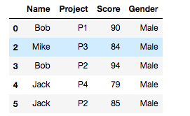

# Pandas Part 3

## 1. 逻辑筛选

[P2 Pandas Part 1](../p2/pandas-part-1.md) 中，我们学习了数据筛选的三个形式，`df[]` ,`df.loc[]` 和 `df.iloc[]`，这三类筛选基本可以胜任任意数据筛选任务。从形式上看，它们都有一个方括号`[]`，这几乎可以成为一个条件反射式的信号：代码中一旦出现方括号`[]`，它大体跟筛选数据脱不了关系。

归纳起来，筛选数据有两类。最直观的方式是在上述三类方括号`[]`中放入行（列）的名称或序号，另外一类是通过布尔值`True or Flase`筛选：每行对应一个布尔值，保留所有行为`True`的数据，基本形式如下：

```python
my_boolean=pd.Series([True,False,False])
df[my_boolean]    # 筛选时，在 [ ]中放入一个布尔值序列
```

## 案例 1

生成一个数据表格 `DataFrame`

```python
data={
    'Name':['Bob','Sara','Mike','Bob','Jack','Jack'],
    'Project':['P1','P2','P3','P2','P4','P2'],
    'Score':[90,86,84,94,79,85],

    'Gender':['Male','Female','Male','Male','Male','Male']    
    }
df=pd.DataFrame(data)
```


筛选列数据`Score`后比较大小，生成布尔值序列。

```python
df['Score']>85

0     True
1     True
2    False
3     True
4    False
5    False
Name: Score, dtype: bool

# 将生成的布尔值序列放入方括号 [ ] 内
df[df['Score']>85]
```

结果筛选出所有`Score>85`的行信息。


## 案例 2: 复合逻辑

同时判断`Score>85`和`Gender=='Male'`，中间用 `&`连接。如果是或，使用`|`连接。

```python
(df['Score']>85)  &  (df['Gender']=='Male')

0     True
1    False
2    False
3     True
4    False
5    False
dtype: bool


df[(df['Score']>85)  &  (df['Gender']=='Male')]
```


```python
(df['Project']=='P1') | (df['Gender']=='Male')

0     True
1    False
2     True
3     True
4     True
5     True
dtype: bool

df[(df['Project']=='P1') | (df['Gender']=='Male')]
```



## 2.表的联合

分析数据时，我们并不总在一张表格内单独完成，有时需要将不同维度的表格联结起来一同处理。Pandas 提供了多个联表函数，形式包括`merge,join 和 concat`。这三类联表方式在功能上有很多重叠，为避免混淆，我们重点学习`merge`方式的联结。

## 2.1 拼接

如果有两张表格，具有相同字段，我们希望将它们上下拼接，可以使用`concat()`函数。

以葡萄酒数据集为例：两张数据表格，分别是红、白葡萄酒数据，具有相同的列名称，可以通过下述方式将两张表上下拼接成一张。

```python
# 读取数据
df_red=pd.read_csv('redwine.csv',sep=';')
df_white=pd.read_csv('whitewine.csv',sep=';')

# concat() 函数拼接 df_red 和 df_white ，ignore_index 表示忽略旧索引，重新生成新索引
df=pd.concat([df_red, df_white],ignore_index=True)
```

## 2.2 Merge

### Merge on column

`merge()`处理的是不同表格依赖某列或索引进行融合的需求。如下图所示，上方两张表都有`Name`字段，我们可以通过该函数依赖`Name`左右融合两表。


上述过程，只需一行代码即可，其中`on='Name'`表示`df1`和`df2`都有`Name`字段时，依赖该字段融合。

```python
df_new=pd.merge(df1, df2,on='Name')
```

这个过程可以解释为：

1. 检索 `df1['Name']` 第一行的值 `Bob`，寻找`Bob`在`df2`对应的`City`，找到后整条行信息新增`City`信息。
2. 如果检索 `df1['Name']`的值在`df2`中没有对应（如`Jack`，`df1`中有，`df2`中没有），则不筛选该行所有信息。
3. 依次检索至`df1['Name]`最后一行。

如果我们希望匹配时，尽管没有对应`City`，仍然保留左侧的`Jack`信息，则可以通过下述代码达成。

```python
df_new=pd.merge(df1,df2,on='Name',how='left')
```

可以看出，没有匹配的`City`被默认填充为`NaN`，表示“无数据”。


上述两类融合方式分别被称为**内连接**和**左连接**，区别在于是否保留未匹配数据。第一类写法实际上省略了默认的`how='inner'`，完整写法如下：

```python
df_new=pd.merge(df1, df2,on='Name',how='inner')
```

我们通过下图呈现的集合关系，区分内连接左连接的区别。 

如果两张表的字段不一致怎么办，如左侧为`Name`，右侧为`Student`。


将`on`分拆成`left_on`和`right_on`即可。

```python
df_new=pd.merge(df1, df2,left_on='Name',right_on='Student',how='inner')
```

两表融合之后，同时存在`Name`和`Student`。 

### Merge on index

`merge()`还可以针对`index`融合，只要更改其中参数即可。

```python
# 手动将 Name 和 Student 设置为 index
df1.set_index('Name',inplace=True)
df2.set_index('Student',inplace=True)
```


分别设置`left_index`和`right_index`为`True`，依赖`index`进行融合。

```python
df_new=pd.merge(df1,df2,left_index=True,right_index=True)
```


### `merge()`**参数总结**

```python
df_new=pd.merge(left, right, how='inner', 
          on=None, left_on=None, right_on=None,
          left_index=False, right_index=False)
```

| 参数 | 说明 |
| :--- | :--- |
| `left` | 左侧数据表格 DataFrame |
| `right` | 右侧数据表格 DataFrame |
| `how` | 融合方式：内连接、左连接 |
| `on` | 连接的共同列名称 |
| `left_on` | 连接的左侧列名称 |
| `right_on` | 连接的右侧列名称 |
| `left_index` | 连接的左侧索引 |
| `left_index` | 连接的右侧索引 |

## 多层次索引

_待续_

