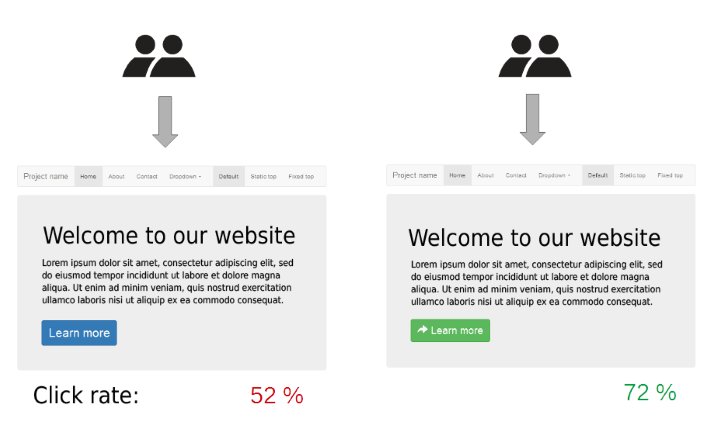
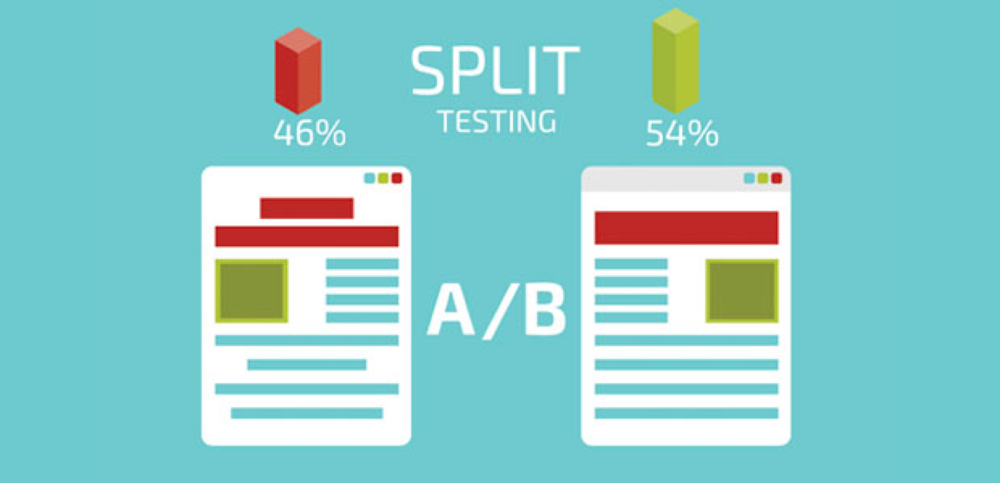
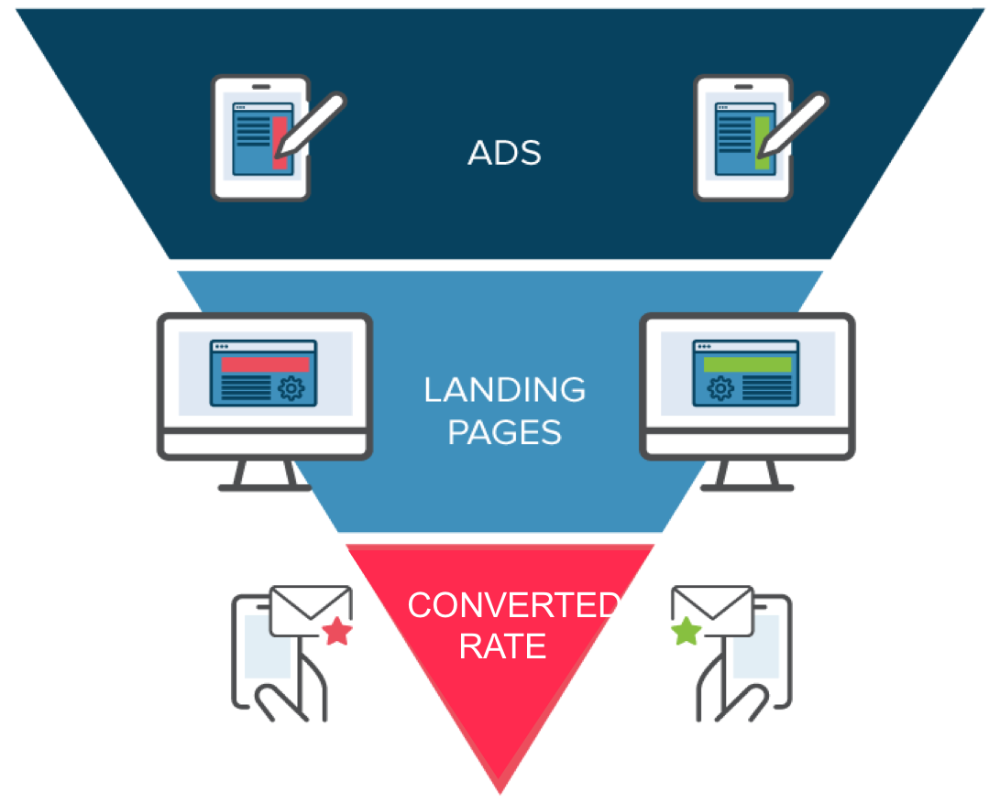
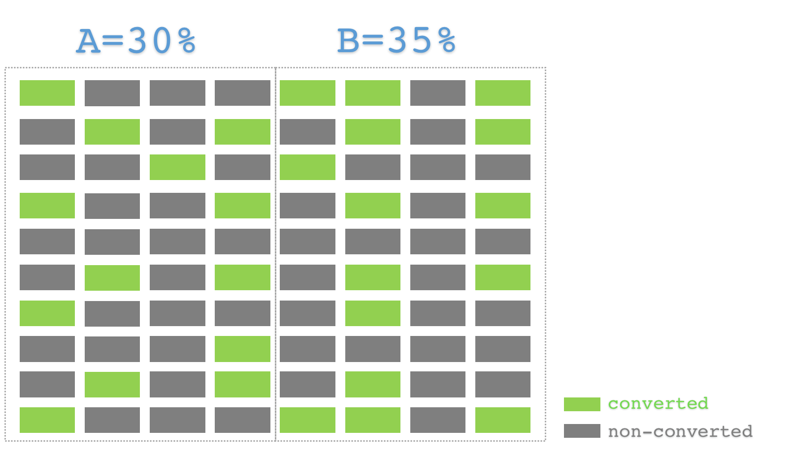

# P4

## 项目简介

使用假设检验理论分析一个 A/B Testing 项目，比较控制组和试验组在某关键指标上是否存在显著性差异。

## 什么是 A/B Testing ?

A/B Testing 主要用于互联网产品在不同方案间的决策评估，以便得到最优的解决方案。

## A/B Testing 案例

### 1.改变 Button 颜色，比较点击转化率

### 2.改变页面排版，比较页面跳出率

### 3. P4-比较不同 Landing Page 的转化率

## 为什么要用统计理论比较 A/B Testing 结果？

假设一项实验比较了两组方案的转化率，A 为控制组，转化率为 30%，B 为实验组，转化率为 35%，我们是否可以得出 B 组方案优于 A 组方案？

在统计理论出现前，人们的决策通常基于经验，基于经验的特征是“看到的差异即是差异”，A/B 两组的结果在直观上存在 5% 的差异，于是我们 “**相信**” B 组方案优于 A 组方案。

注意这里的“**相信**” ，如果提问给这个“相信”附上一个确信程度，没人敢说自己是100% 肯定 B 方案必然优于 A 方案，万一这次的实验结果只不过是大量随机结果中的一个，且恰巧显示出了一个 5% 的差异呢？

应用统计理论，可以对这类差异进行可能性分析，从中得到一个确信程度，来判断 这个5% 的差异到底是不是有意义的，这在统计学上就叫做**显著性差异**，而确信程度则可以对应于统计学里的“**置信水平**”。

_注：为了方便理解，这里的显著性差异和置信水平并不是严格定义的。_

## P4 任务

有了上面的铺垫，P4 的任务就是通过统计学理论来判断一个 A/B Testing 的结果是否具有显著性，并根据显著性结果作出决策。

## 能力要求

1. 掌握统计学基础概念
2. 使用 Python 模拟概率模型和抽样分布
3. 使用 bootstrapping 技术进行假设检验和显著性判断
4. 使用回归分析 A/B Testing 结果

| 序号 | 内容 | 视频章节 | 建议时间 | 能力要求 |
| :--- | :--- | :--- | :--- | :--- |
| 1 | 统计学基础概念介绍 | 选修： Lesson 1 - Lesson 10 | 第1周 | 掌握统计学基础概念 |
| 2 | 假设检验 与 A/B Testing | 必修： Lesson 10 - Lesson 13 | 第2周 | 1.掌握 bootstrapping _Lesson 10_ 2.掌握置信区间 _Lesson 11_ 3.掌握假设检验 _Lesson 12_ |
| 3 | 回归分析 | 必修： Lesson 14 - Lesson 16 | 第三周 | 使用回归模型分析 A/B Testing 结果 |

