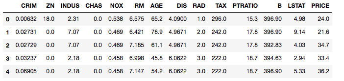

# 线性回归

## 1. 线性方程：寻找事件间的联系

假设一个变量 $$Y$$，受一组变量 $$X=(x_1,x_2,...,x_n)$$ 影响，即 $$Y$$与 $$X$$ 相关，之间的函数关系表示如下：

$$Y=f(X)+\epsilon$$

$$\epsilon$$ _为随机误差_

在现实世界，我们可能永远无法得知 $$Y$$ 和 $$X$$ 之间确定的、先验的、形式化后的数学关系（ _**Maybe it's God's law**_ ），甚至都无法确认 $$Y$$ 和 $$X$$ 是否存在关联。但人们总是有探究事物间联系的倾向，希望通过观测数据和推理逼近“真相”。

事物间联系在数学表达上千差万别，最简洁的是变量间的线形关系，线性方程 $$F$$ 表达如下：

$$F:\;y=\theta_0+\theta_1x_1+\theta_2x_2+......+\theta_n x_n$$

线性方程描述了这样的一组关系：每一个变量 $$x_i$$ 都对应一个系数 $$\theta_i$$，当其他条件不变时，$$x_i$$ 增加 1 个单位，$$y$$ 增加 $$\theta_i$$，简单来讲，$$y$$ 的变动和 $$x_i$$ 的变动呈比例关系，该比例就是 $$\theta_i$$。我们称 $$\theta_i$$ 为**系数** $$coefficient$$。

另一方面，从上述方程中可以看出，当所有变量 $$x_1,x_2,...,x_n$$ 都为零时，$$y=\theta_0$$，我们称 $$\theta_0$$ 为 **截距** $$intercept$$。_（务必理解这两个概念，回归部分的讲解会反复提到它们。）_

如果 $$y$$ 只与一个变量 $$x_1$$ 相关， $$x,y$$ 的取值对应在坐标系中，就是一条直线，此时的截距就是直线与 $$y$$ 轴的交点。

线性方程为：

$$F:\;y=\theta_0+\theta_1x$$

## 寻找线性方程 $$F$$

有一对变量 $$x,y$$，$$y$$ 表示房价，$$x$$ 表示房屋面积，现有 1000 个样本数据，

$$ \begin{matrix} x\_1 & y\_1

\ x\_2 & y\_2

\

\vdots & \vdots &

\ x_{1000} & y_{1000}

\ \end{matrix}$$

将 1000 个数据点对应到直角坐标系中，生成散点图。


从散点分布来看，我们不可能绘制一条直线，使得所有数据点都恰好落在它上面。退而求其次，我们却可以找到一条使得散点与之相对贴近的直线。

那么，如何衡量一条直线与所有散点贴近程度？

用的方法是：找到一条直线，使得所有散点到直线距离的平方和达到最小。

我们在原始的数据上增加一列，$$f(x)$$ 表示通过线性方程计算所得的预测值。

$$ \begin{matrix} x\_1 & y\_1 & f\(x\_1\)

\ x\_2 & y\_2& f\(x\_2\)

\

\vdots & \vdots & \vdots &

\ x_{1000} & y_{1000}& f\(x\_{1000}\)

\ \end{matrix}$$

所有散点到直线距离的平方和可以如下表达：

$$C(\theta)=\sum_{i=1}^{1000}(f(x_i)-y_i)^2$$

最终，只要使得 $$C(\theta)$$ 达到最小值，我们就找到了这条最贴近散点的直线。

这条直线的函数表达式，就是所谓的线性回归方程。

## 2. 使用 $$statsmodels$$ 模块计算回归方程

寻找线性方程 $$F$$ 是一个十分繁琐的过程，但计算机时代已不再是麻烦事，Python 中的很多第三方模块都提供了计算回归方程的方法，我们以 $$statsmodels$$ 来演示求解过程。

我们以**波士顿住房数据**为例，对波士顿房价做回归分析。

### 案例：Boston Housing

说明：数据集可以通过 $$sklearn$$ 模块直接导入，无需单独加载数据文件。

```python
import statsmodels.api as sm   # 导入 statsmodels 模块
from sklearn.datasets import load_boston # sklearn 中的波士顿住房数据

# 通过代码直接读取数据文件
>>> boston=pd.DataFrame(boston_data.data,columns=boston_data.feature_names)
>>> boston['PRICE'] = boston_data.target
>>> boston.head()
```



**注：相关字段的解释可以通过输入**`print(boston_data.DESCR)`**查看。**

`PRICE` ：房屋价格

`RM`：住房的房间数量

`LSTAT`：该地区低收入人群占比

我们先来研究房间数量 `RM` 与房屋价格 `PRICE` 之间的关系。

```python
# 步骤一： 初始化截距，令 intercept = 1
boston['intercept']=1

# 步骤二：生成变量 X,Y
X = boston[["RM","intercept"]] # 注意不要丢了 intercept
Y = boston["PRICE"]

# 步骤三：拟合线性回归方程
model = sm.OLS(Y, X).fit()

# 步骤四：输出结果
model.summary()
```

**返回结果：**


### 解读回归结果

通过 $$statsmodels$$ 计算回归方程最终会返回一系列统计结果，我们只需重点关注上图红框部分内容。

其中红框中的 $$\textbf{coef}\;$$即表示经计算的系数和截距。

$$\textbf{Price}=-34.6706+9.1021*\textbf{RM}$$

### 评估线性方程

对于任意数据，我们都可以计算得到一个线性方程，但得到的结果却有好有坏。

看下面两个例子：


左图数据本身显示出了一定的线性关系，得到的回归方程也很好的拟合了原始数据。但右图的效果就没那么好了，数据点过于稀疏，并没有很好得贴近回归线。

在 $$statsmodels$$ 的计算结果中，有两类指标可以评估线性方程。

### R-squared

R-squared 用来评估 $$y$$ 的变动，多少比例来自变量 $$x$$，取值范围为`[0,1]`。

越贴近 1 表示 $$y$$ 的变动越能通过$$x$$的变动来解释。

越贴近 0 表示 $$y$$ 的变动很少受$$x$$的变动影响。

## $$\textbf{P>|t|}$$

我们得到一个线性方程 $$y=\theta_0+\theta_1x\;$$ 其实是事先假定变量之间存在关系的。如果 $$x,y$$ 本身没有关系，那么得到线性方程只能是个一厢情愿的结果。

在 $$statsmodels$$ 的结果中，就提供了一个判定 $$x,y$$ 是否存在关系的参数，就是 $$\textbf{P}$$ 值。

通俗得讲，$$statsmodels$$ 计算时，内部就做好了假设检验，两个假设分别是：

$$H_0: \theta = 0$$

$$H_1: \theta \neq 0$$

零假设表示 $$x,y$$ 没有关系，那么 $$x$$ 前的系数 $$\theta=0$$。

对立假设表示 $$x,y$$ 有关系，那么 $$x$$ 前的系数 $$\theta\neq0$$。

因此，会得到一个 $$\textbf{P}$$ 值，当 $$p < 0.05$$ 时，则有显著性关系，$$\theta\neq0$$，$$x,y$$ 相关。

如果$$p \geq 0.05$$ ，则接受$$\theta=0$$，$$x,y$$ 不相关。

因此，从上述波士顿住房数据来看，`RM` 的 $$\textbf{P}$$ 值等于 0，表示有很强的相关性，$$\textbf{R-squared}=0.484$$ 则意味着 `Price`的变动仅部分由`RM`解释，还存在其他相关因素尚未纳入研究。

## 3. 多重共线性

通过上述分析，我们知道`Price`的变动不只受`RM`影响，那么如何改进我们的模型提升拟合结果呢？

我们可以尝试增加更多变量，比如`LSTAT`字段等，让模型纳入更多的可能影响因素。那么，变量是不是越多越好呢？当然不是！

增加变量过程中，需要考虑一个问题，变量和变量之间是否本身存在关联。

比如，增加一个 2 倍的`RM`,假设它的字段名为 `BM`，分别用 $$x_1,x_2$$ 表示。

计算得到如下回归方程时，会发现原来具有显著性的`RM`会被严重曲解，变得不那么显著了。这种情况我们称变量间的多重共线性造成回归结果偏离实际。

$$F:\;y=\theta_0+\theta_1x_1+\theta_2x_2$$

具体影响请参考课程视频

 _**课程15:多元线性回归 &gt;&gt;&gt;17.多重共线性与 VIF**_

