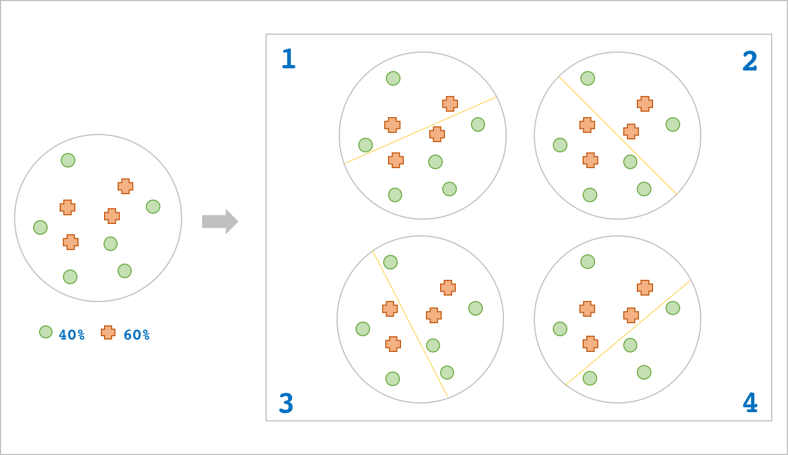
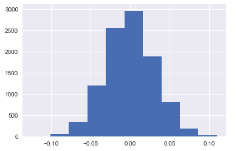
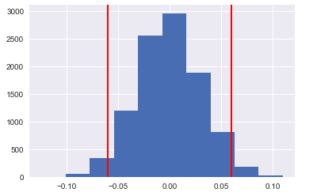
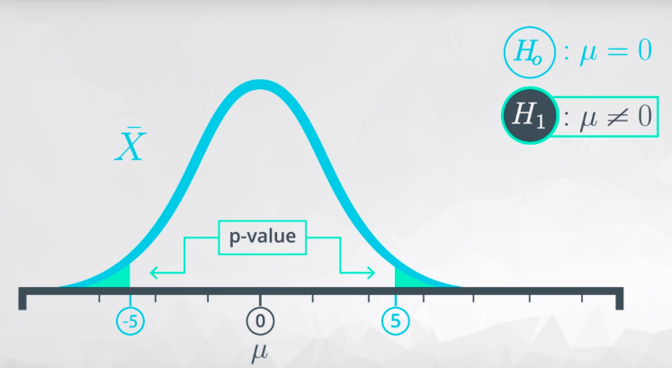
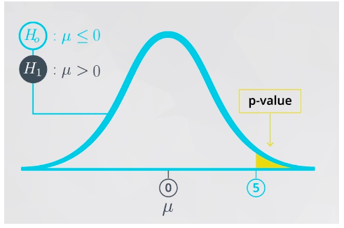
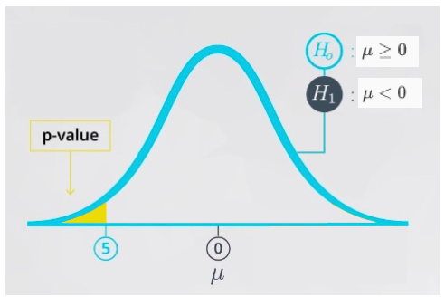

# 假设检验

考虑这样一个问题，蛋糕上撒有**均匀但未必随机分布**的绿色和橙色两种糖豆共 1000 颗，绿色糖豆占比为 40% 。现在，在蛋糕上对半切一刀，分为 A 和 B 两个区域（A, B 区域各 500 颗）。

此时，A 区域绿色糖豆占比 35%，B 区域占比 45%，我们来研究下这 10% 的差异可能来自哪里。

## 差异来源

上述差异的性质有两类，第一类是随机性的，第二类是系统性的。

对于第一类，主要源自切分方式随机性带来的偶然差异，如下图所示，这样的差异难以避免。



对于第二类，，切分方式的随机性造成的差异则是次要的，差异更像是必然的，绝对的。比如我们有倾向性得在 B 区域洒上更多绿色糖豆。

那么，我们如何判断观察到的差异是随机的、偶然的，还是显著的、必然的。

## 零假设

首先假设 10% 的差异是随机产生的，蛋糕上的糖豆按照 4:6 的比例完全**随机分布**。既然糖豆的分布是随机的，那么 A, B 区域的绿豆占比差异平均来看等于 0。

如果用形式化表达，可以抽象为：

$$H_0:\mu_b - \mu_a=0$$

表示 A, B 区域的绿色糖豆占比平均来看没有差异，10% 的差异是随机产生的，我们称之为**零假设**。

### Python 模拟随机过程

在零假设下，我们期望验证实际 10% 的观测差异是否合理，合理程度有多大？

回答上面问题，我们需要足够的样本数据来推断。

既然在零假下，糖豆的分布是完全随机的，那以下两种抽样方式可视作等价的：

1. 蛋糕切割 $$n$$ 次，记录每次 A, B 区域绿色糖豆占比的差异。
2. 有一台自动发豆机，以 40% 和 60% 的可能性向 A, B 区域填充两类糖豆，反复填充 $$n$$ 次，记录每次 A, B 区域的绿色糖豆占比的差异。

我们用 bootstrapping 方式模拟第 2 种形式：

每次抽样记 A 区域的绿豆占比为 $$\alpha$$，B 区域占比 $$\beta$$，差异为 $$d$$，如下所示。

$$ \begin{matrix} \alpha\_1 & \beta\_1 \quad➡️ \;d\_1 =\beta\_1-\alpha\_1

\ \alpha\_2 & \beta\_2 \quad➡️ \;d\_2 =\beta\_2-\alpha\_2

\

\vdots & \vdots &

\ \alpha\_n & \beta\_n \quad➡️ \;d\_n =\beta\_n-\alpha\_n

\ \end{matrix}$$

按照中心极限定理，$$n$$ 足够大时，$$(d_1,d_2,...,d_n)$$ 会近似呈现正态分布。

```python
>>> D=[]
>>> for i in range(10000):                             # 重复试验 10000 次
        A=np.random.choice([1,0],p=[0.4,0.6],size=500) # A 区域 40% 的可能性填充绿豆
        B=np.random.choice([1,0],p=[0.4,0.6],size=500) # B 区域 40% 的可能性填充绿豆
        d=B.mean()-A.mean()                            # B 与 A 的绿豆占比差异
        D.append(d)                                    # 添加至列表 D
>>> D=np.array(D)
>>> D
array([ 0.016,  0.024, -0.022, ...,  0.04 , -0.068, -0.034])
>>> plt.hist(D);
```



### 零假设判定

在零假设下，差异值的分布近似趋近于均值为 0 的正态分布。正态分布曲线的特点是，取值越靠近中心区域可能性越大，越靠近两侧极端位置可能性越小。

那么，正态分布下，我们如何描述一个合理的取值区间呢？

常用的方法是，我们事先定义一个合理程度，比如 95%，然后找出两个基于正态曲线中心轴对称的位点 \($$a$$, $$b$$\) ，使之与曲线围成的面积占比等于 0.95 即可。

于是，这样一个 95% 的取值区间我们可以这样描述它：有 95% 的可能性，差异值会落在 \($$a$$, $$b$$\) 之间。

`numpy`提供了找出这样位点的简单函数`percentile()`，参数输入序列和百分数即可。

**代码模拟如下**

```python
>>> lower,upper=np.percentile(D,2.5),np.percentile(D,97.5)
>>> lower,upper
(-0.06, 0.06)
>>> plt.hist(D)
>>> plt.axvline(lower,color='red')
>>> plt.axvline(upper,color='red');
```



在零假设下，差异值有 95% 的可能性落在 `(-0.06, 0.06)`之间，这意味着差异值等于 10% 的可能性极低，它处于正态分布两侧极端位置。

但是这样一个近乎不可能的值恰恰被观测到了，我们有理由推断上述的零假设不成立。

因此：

$$\mu_b - \mu_a\neq0$$

我们将零假设的对立面称为对立假设，记为 $$H_1$$ ，于是这 10% 的差异并不是随机产生的，显著性是存在的。

## $$p$$ 值

归纳上面的判定步骤，大致流程是这样的：

1. 建立一个零假设 $$\quad H_0:\mu_b - \mu_a=0$$   
2. 创建一个基于零假设的正态分布
3. 判定实际观测值在上述正态分布的位置，判断其合理性
4. 如果（3）被判定不合理，我们就采纳$$\quad H_1:\mu_b - \mu_a\neq0$$   

但是，实际问题的思考过程却是相反的。比如，在 AB Testing 中，我首先有一个研究倾向，希望判定$$\mu_b - \mu_a>0$$ 是否正确。

有了这样一个目的，我们再反过来确认零假设 $$\mu_b - \mu_a\leq0$$是否合理，一旦零假设被证明不合理，我们就接受 $$\mu_b - \mu_a>0$$ 的判断。

这样一来，看上去我们是先建立对立假设，再反过来确定零假设，它更像是一个思考的逆向工程。

基于这样的思考过程，我们改一下上面的流程：

1. 明确一个研究目的，比如 $$\quad H_1:\mu_b - \mu_a>0$$  
2. 根据（1）建立一个零假设 $$\quad H_0:\mu_b - \mu_a\leq0$$   
3. 创建一个基于零假设的正态分布
4. 判定实际观测值在上述正态分布的位置，判断其合理性
5. 如果（4）被判定不合理，我们就采纳$$\quad H_1:\mu_b - \mu_a>0$$   

**合理性判断**

在上述流程中，有一个重要步骤，就是零假设的合理性判断。

日常语言中，什么样的观察值算是极端是没有具体边界的，要么基于共识，要么因人而异。

统计语言里，我们得给这类判断做定量表达，这里我们引入一个概念，叫做 $$p$$ 值。通俗得讲，$$p$$ 值就是这么一个判断取值是否合理的定量表达。

在糖豆案例中，我们的零假设是 $$\quad H_0:\mu_b - \mu_a=0$$ ，当取值落在两侧极端位置时，我们就有理由判断零假设不合理，从而接纳对立假设 $$\quad H_1:\mu_b - \mu_a\neq0$$。

当给到一个观测值，怎么才算极端呢，怎么用某个概率定量判断？

在这样的零假设下，只要将它对于零点找一个对称位点，然后计算往两侧延伸的概率和，这里的概率和就称为 $$p$$ 值，通常只要 $$p< 5\%$$ 就算极端了。



再看另一类零假设：

$$H_0:\mu_b - \mu_a\leq0$$ 。

与糖豆案例不同，是否极端通过判断观测值右侧的取值可能性即可。



最后一类零假设：

$$H_0:\mu_b - \mu_a\geq0$$ 。

$$p$$ 值由观测值左侧的取值可能性来表示。



有了 $$p$$ 值概念，我们可以将假设检验的最终步骤归纳为：

1. 明确一个研究目的，设立对立假设 $$H_1$$
2. 根据（1）建立一个零假设 $$H_0$$
3. 创建一个基于零假设的正态分布
4. 计算观测值基于零假设分布的 $$\,p\,$$ 值
5. 如果 $$p < 5\%$$，则拒绝零假设 $$H_0$$，接受对立假设 $$H_1$$
6. 如果 $$p \geq 5\%$$，保留零假设 $$H_0$$

