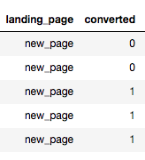

# 逻辑回归

逻辑回归和线性回归相似，同属于通用线性模型的特例，但两者处理的问题不同。

线性回归用来预测一个连续的数值型变量，比如房价、收入等，但对于非连续的离散变量，比如一笔信用卡交易是否属于诈骗，它的取值只有“是”和“否”，或 1 和 0，线性回归就不好处理了。

这类问题，我们更关心的是给定相关变量 $$X$$ 的观测结果后，判断 $$Y$$ 在 1 和 0 上的概率分布情况。

比如下面的信用卡交易数据中，每一行都记录了交易时间和是否诈骗的信息，我们可以通过对已有数据构造逻辑回归模型（建立 $$X$$ 和 $$Y$$ 之间的关系），以此判断当给定一组新的数据时，该交易是否属于诈骗。


## 逻辑回归方程

在线性回归中，回归方程直接通过实际变量构造，而逻辑回归则需要做点改动，我们的做法是将预测量的**发生比**取对数，再创建回归方程。

线性回归：$$y=\theta_0+\theta_1x_1+\theta_2x_2+......+\theta_n x_n\quad(1)$$

逻辑回归：$$log\frac{p}{1-p}=\theta_0+\theta_1x_1+\theta_2x_2+......+\theta_nx_n\quad (2)$$

对上述逻辑回归方程稍做变换，两侧取 $$e$$ 为底，结果为

$$\frac{p}{1-p}=e^{\theta_0}\cdot e^{\theta_1x_1}\cdot e^{\theta_2 x_2}... e^{\theta_2 x_n}\quad (3)$$

从表达式 $$(3)$$ 可以看出，逻辑回归方程返回的结果是预测量发生\($$p$$\)与不发生\($$1-p$$\)的概率比。

### 发生比

假设一个字段 `fraud` 结果只有 1 和 0，分别表示诈骗和非诈骗。发生比表示诈骗的概率与非诈骗概率的比值。记诈骗的概率为 $$p$$，非诈骗即为 $$1-p$$。

因此，$$\frac{p}{1-p}>1$$ 时，诈骗可能性更大，$$\frac{p}{1-p} < 1$$ 时，非诈骗可能性更大 。

应用到实际数据时，我们通过 $$statsmodels$$ 的 $$Logit$$ 逻辑回归方法生成回归方程，就可以用来检测一组新的数据是否诈骗了。

## 案例： 信用卡诈骗

我们使用 【课程 16：逻辑回归 &gt;&gt;&gt; 5. Notebook + 练习】中的数据集，演示如何创建逻辑回归模型，并解释拟合结果。

执行回归模型，归纳起来分为三个步骤：

1. 使用`pd.get_dummies()`函数将变量转化成数值。
2. 选取所需的列数据
3. 
### 1. 数据处理

**读取数据**

```python
df = pd.read_csv('fraud_dataset.csv') # 请于课程资源区自行下载数据集
```

**将变量转化成数值**

```python
# 将 fraud 字段转成数值，结果会返回两颗数据。
pd.get_dummies(df['fraud'])
```


```python
# 将数值结果存储为新的列
df[['no_fraud','fraud']]=pd.get_dummies(df['fraud'])
df.head()
```


```python
# 同理，将day字段转成数值，并存储为新的列
df[['weekday','weekend']]=pd.get_dummies(df['day'])
df.head()
```


### 2. 选取研究变量

我们的研究目的是探索`fraud`和`day`之间的关系，但是经过上述处理之后，每个变量都各自膨胀成了两列数据：

```text
fraud  ---> (fraud, no_fraud)
day    ---> (weekday, weekend)
```

那么，我们该怎么选用数据？

仔细观察膨胀之后的数据，如`(fraud, no_fraud)`，可以发现其实只需要一列数据，它就能反映该字段的所有信息。比如当`frauld=1`时，`no_frauld`必然等于`0`。因此，在选择研究变量的时候，只需要选用一列即可。`weekday, weekend`字段同理。

> 如果某个字段 $$X$$，只有三类值 $$A,B,C$$，`get_dummies()`生成新的三列 $$A,B,C$$ 后，只需取任意两列分析，因为第三列（比如 $$C$$）是完全由前两列确定。

`get_dummies()` 相关内容，可以参考【课程 15：多元线性回归 &gt;&gt;&gt; 8 ~ 13】的虚拟变量部分内容。

#### 选取变量

```python
# 将多余的字段删掉
df=df.drop(['no_fraud','weekend','day'],axis=1)
df.head()
```


上述代码选用了`fraud`和`weekday`作为研究变量，这时当`fraud=1`表明属于诈骗邮件；当`weekday=1`时，表明该天为工作日。

### 3. 构造逻辑回归模型

```python
# 初始化截距
df['intercept'] = 1

# 构造逻辑回归模型： sm.Logit(Y,X) 中参数分别填入预测的变量和分析的变量 X
lmodel = sm.Logit(df['fraud'], df[['intercept', 'duration','weekday']])

# 查看结果
result = lmodel.fit()
result.summary2()
```


## 拟合结果分析

套用逻辑回归方程，可以分析变量的变动对发生比的影响。

$$\frac{p}{1-p}=e^{\theta_0}\cdot e^{\theta_1x_1}\cdot e^{\theta_2 x_2}... e^{\theta_2 x_n}\quad (3)$$

对于`duration`，系数 $$Coef.=-1.4637$$，意味着`duration`每增加 1 个单位，发生比是原来的 $$e^{-1.4637}$$ 倍，计算可得 `np.exp(-1.4637)=0.2313`，实际是降低了诈骗的可能性。

对于`weekday`，系数 $$Coef.=2.5465$$，意味着`weekday`从 0 变到 1 （`weekday`只有两个取值，0 和 1），发生比是原来的 $$e^{2.5465}$$ 倍，计算可得`np.exp(2.5465)=12.7623`，也即是从`weekend` 变到`weekday`，提升了 12.763 倍诈骗可能。

## 使用逻辑回归 P 值判断假设检验结果

我们除了可以通过系数的大小判断$$\;X,Y\;$$之间的变动关系，还可以通过统计数据中的 P 值验证假设检验结果。

以`weekday`字段为例：

零假设 $$H_0: Coef. = 0$$

对立假设 $$H_1: Coef. \neq 0$$

查看 `weekday`的 P 值小于 0.05，可以判断是否诈骗与是否工作日存在显著关系。

同理，在一个 AB Testing 中，我们也可以通过逻辑回归结果中的 P 值来判断结果`converted`是否与页面`landing_page`存在显著关系。 

