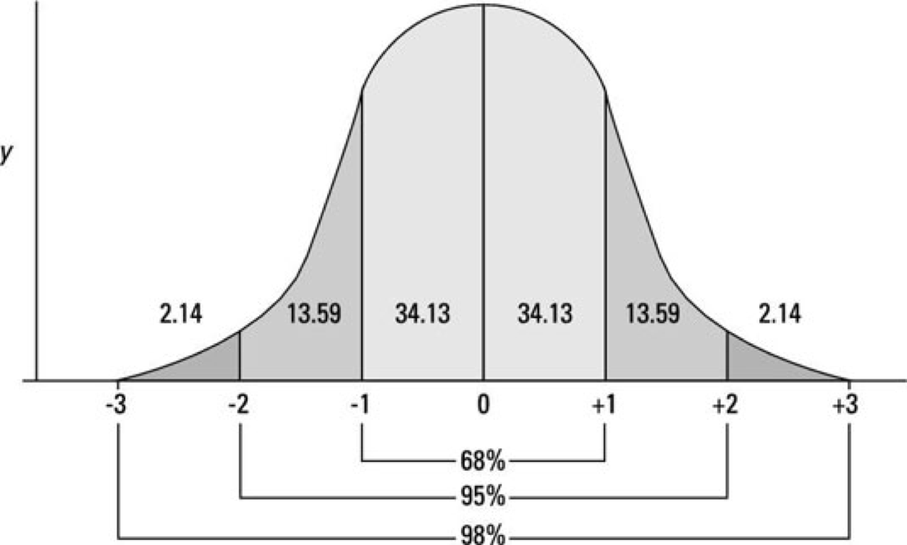

# 概念基础

## 总体与样本

$$population\; and\; sample$$

统计学的最大应用场景是通过样本估算总体，比如要得到全国大学生的平均身高，就可以用某特定样本的均值来逼近。总体通常是未知的，而样本则可以通过特定实验获得。凭样本估算总体是统计学里的一个永恒话题，也是我们学习的重点。

## 参数与统计量

$$parameter\; and\; statistic$$

参数特指总体的一些数字特征，比如均值 $$\mu$$ 、方差 $$\sigma^2$$、标准差 $$\sigma$$等。既然参数是整体的数字特征，它通常是未知的。

统计量则不同，它与样本直接相关，通过样本计算所得，比如样本均值 $$\bar{x}$$、样本标准差 $$s$$等。

在统计理论中，参数估计是一个十分重要且特化的部分，估计的方式就是构造合适的统计量，一个简单的例子就是当样本数量足够大的时候，我们可以用样本均值 $$\bar{x}$$ 来逼近总体均值 $$\mu$$ 。

## 随机变量

$$variable$$

随机变量是我们选取的研究对象，包括连续型变量（如页面访问时长）和离散型变量（页面是否被点击）。一个随机变量有多个可能性取值，构成一个“取值上可能性空间“。

## 概率分布

$$probability \;distribution$$

概率分布体现一个随机变量取值结果的分布情况，最重要的概率分布是正态分布。

正态分布有两个重要参数，均值$$\mu$$ 和标准差 $$\sigma$$，决定了正态分布的形状。

概率分布图形用坐标轴围成的面积反应取值区间的概率大小，比如在上图标准正态分布（均值=0，方差=1）中，曲线围成的总面积等1，而区间 $$[-2,2]$$ 围成的面积等于95%，意味着随机变量在 $$[-2,2]$$ 的取值概率为 95%。

从图形上看，正态分布越往两侧极端位置，比如 $$[2,3]$$，可能性就越低。

