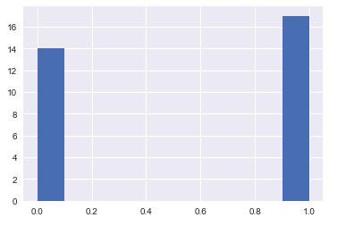
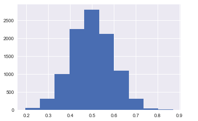
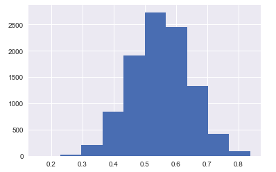

# 中心极限定理与抽样分布

在概率统计中，正态分布曲线是一类神奇的曲线，不仅因为它自身特点（对称、中间高两头低）使其具备很强的解释性，还因为很多其他分布问题可以最终通过逼近正态分布得以简化。而这类简化涉及的理论基础就是概率统计中的一个重要定理——中心极限定理。

通俗地讲，中心极限定理反应的是这样一个近似过程： 在一定条件下，大量相互独立的随机变量经过**加总或均值**处理后，其分布收敛于正态分布。

## 案例

中心极限定理给出一个将普通分布构造成正态分布的方案：计算大量独立随机变量的和或者均值。

以均值为例，我们来看看它在扔硬币模型中的应用。

首先定义每次扔硬币的结果为随机变量 $$X$$，一共扔 $$n$$ 次，分别记为 $$X_1,X_2,X_3...X_n$$。

用 `numpy`模拟 31 次扔硬币结果，画出分布图形。

```python
>>> test=np.random.randint(2,size=31)
>>> test
array([1, 1, 0, 1, 1, 0, 1, 1, 0, 0, 1, 0, 0, 1, 1, 0, 0, 1, 0, 1, 0, 1,
       1, 0, 0, 1, 1, 1, 0, 1, 0])
>>> plt.hist(test);
```



仅就每次扔硬币的结果画出的分布图形来看，这是一个取值只有0或者1的分布，与正态分布毫不相关。

如果换一种取值方式，那么情况就大不一样了。

### 步骤一：现在一共扔 $$m$$ 组，每组扔 $$n$$ 次硬币，结果记录如下

$$\begin{matrix} X_{11} & X_{12} & \cdots & X_{1n} \\ X_{21} & X_{22} & \cdots & X_{2n} \\ \vdots & \vdots & \ddots & \vdots \\ X_{m1} & X_{m2} & \cdots & X_{mn} \\ \end{matrix}$$

### 步骤二：计算每组的平均值

$$y_1=\frac{1}{n}(X_{11} + X_{12} +... + X_{1n} )$$

$$y_2=\frac{1}{n}(X_{21} + X_{22} +... + X_{2n})$$

...

$$y_m=\frac{1}{n}(X_{m1} + X_{m2} +... + X_{mn})$$

当 $$m,n$$足够大的时候 $$(y_1,y_2...y_m)$$ 大致呈现正态分布。

**代码验证**

```python
>>> y=[]  # 建立一个空列表，用于存储数据
    for i in range(10000):              # 扔 10000 组
        x=np.random.randint(2,size=31)  # 每组扔 n=31 次
        y.append(x.mean())              # 每组计算平均值，结果加入列表 y
>>> y=np.array(y)
>>> y
array([0.58064516, 0.70967742, 0.38709677, ..., 0.58064516, 0.51612903,
       0.5483871 ])

>>> plt.hist(y);
```



可以看出，将大量随机变量成组并求平均值后，其分布会逼近正态分布分布。

## bootstrapping 抽样

上述例子，我们通过不断新增扔骰子的次数和组数，扩充收集的样本数量，最终画出正态分布。

但这种新增样本的方式在面对现实问题时，往往很难做到，现实只让我们针对特定的实验数据做推断。鉴于这类局限，统计学家发明了一种基于计算机技术的自抽样方式 bootstrapping，将样本视为总体，从样本中反复抽样，将反复抽样的结果用以推断总体。

沿用上述例子，用 bootstrapping 方式抽样的方式可以简述如下：

1. 记录扔 31 次骰子的结果
2. 从上述结果中随机有放回地抽样 31 次，计算平均值
3. 重复（2）的操作 10000 次

```python
>>> test=np.random.randint(2,size=31) # 记录 31 次扔骰子的结果
>>> y=[]
    for i in range(10000):                # 自抽样 10000 次
        x=np.random.choice(test, size=31) # 从 test 中有放回地随机抽样 31 次
        y.append(x.mean())                # 平均值加到列表 y 中
>>> y=np.array(y)
>>> y
array([0.38709677, 0.38709677, 0.61290323, ..., 0.4516129 , 0.61290323,
       0.58064516])

>>> plt.hist(y);
```



