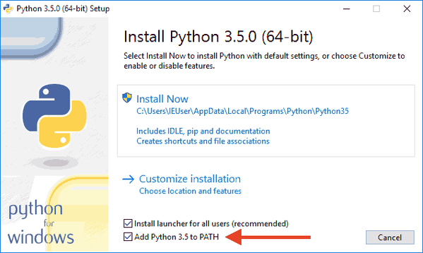
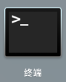
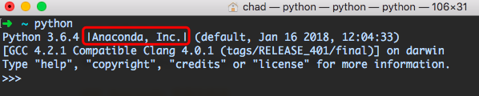
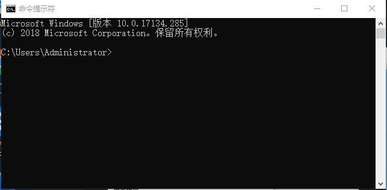
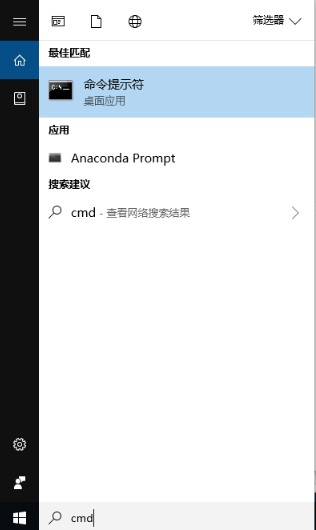
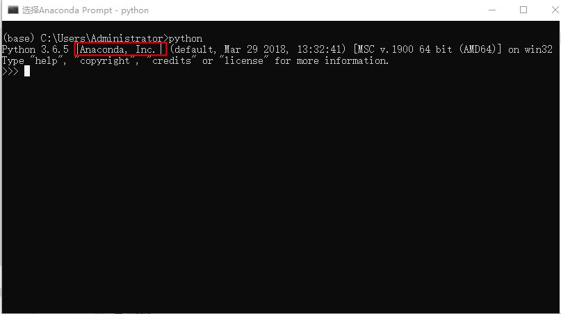
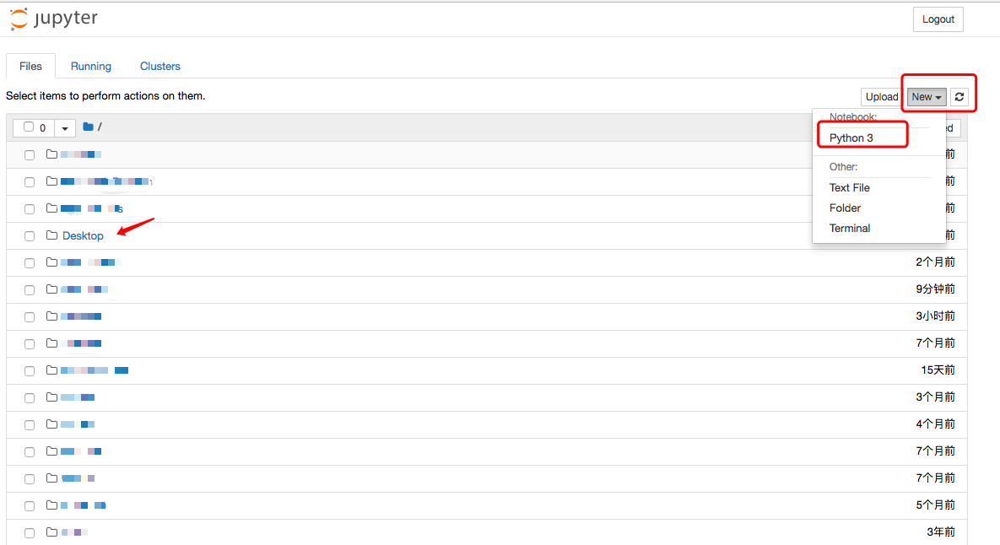
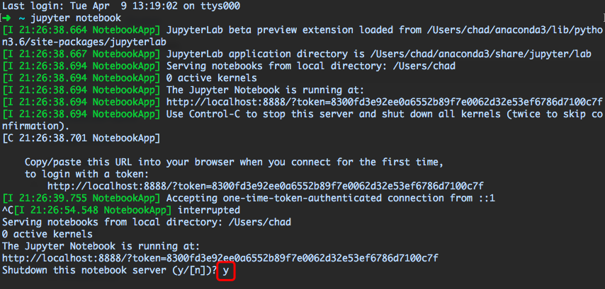

# 课前预备

## 1. Python 安装

如果你已经安装有 Python 3.0 以上的版本，可以忽略本步骤。

### 1.1 Mac

如果你使用 Mac，系统已自带 Python 2.7版本，需要安装 Python 3.0 以上的版本（下述以 Python 3.6 为例），有两个方法：

1. 从 Python 官网下载Python 3.6的[安装程序](https://www.python.org/ftp/python/3.6.3/python-3.6.3-macosx10.6.pkg)，双击运行并安装；
2. 如果你安装了Homebrew，直接通过命令在终端输入 brew install python3 即可；

### 1.2 Windows

1. 首先，根据你的 Windows 版本（64位还是32位）从 Python 的官方网站下载 Python 3.6对应的[64位安装程序](https://www.python.org/ftp/python/3.6.3/python-3.6.3-amd64.exe)或[32位安装程序](https://www.python.org/ftp/python/3.6.3/python-3.6.3.exe).
2. 运行下载的EXE安装包,特别要注意勾上Add Python 3.6 to PATH，然后点“Install Now”即可完成安装，如下图所示：

   

**注**：也可以观看官方课程【python入门&gt;&gt;课程6-脚本编写】的前五讲视频。

## 2. Anaconda 安装与启动

### 2.1 安装

Anaconda 是一个基于 Python 的数据处理和科学计算平台，它内置了许多常用的第三方模块，这些模块相当于一个个集成在 Python 内部的工具包，能够执行特定功能。

根据你的系统，从 [Anaconda](https://www.anaconda.com/download/) 官网下载 GUI 安装包，下载后直接安装；

### 2.2 启动

#### 2.2.1 Mac

* 打开启动台，找到终端（ Terminal ），点击打开

* 手动输入`python`,如果在 python 版本号后边有 `Anaconde`字样，则表明安装成功。

* 在`>>>`后面输入`exit()`退出 python 环境。

#### 2.2.2 Windows

 **小知识：命令提示符——CMD**

CMD 是 Windows 下的命令行窗口，我们可以通过命令行窗口完成系统级的指令操作。如果你已经安装了 Python，并准备启动它，也将是在 命令行窗口输入`python`启动。

**熟悉命令行窗口**

点击 windows 开始按钮，搜索`cmd`, 在弹出的搜索结果中点击进入。也可以按 Win+R 的组合键打开命令提示符 ，输入 `cmd`，进入下面窗口。

**启动带有 Anaconda 的 Python 版本**

如果你成功安装了 Anaconda，搜索 `cmd`后, 可以看见这时候除了系统自带的命令提示符，还多了一个应用 Anaconda Prompt，点击 Anaconda Prompt 后同样会进入命令行窗口，然后输入 `python` 即可启动 Python。退出 Python 环境，输入 `exit()`即可。

**说明**：经 Anaconda 启动 Python ，会带有 "Anaconda, Inc" 信息。

## 3. Jupyter Notebook

Jupyter Notebook 是一个在数据分析领域非常实用的编程工具，让我们可以以文档的形式书写报告、编辑/运行代码、展示可视化结果。这也是我们课程中首推的文档编辑器，未来的项目书写和提交大多都会用到。

### 启动

如果你已经成功安装 Anaconda ，那么启动终端（ Mac 环境下）或 Anaconda Prompt（ Windows 环境下）后，可以直接输入 `jupyter notebook` ，等待几秒，就会自动在你的浏览器中打开。

**关闭 Jupyter Notebook：**

回到命令行窗口，按住 Ctrl+c 组合键，在命令行弹出“是否关闭”的提示后，输入`y`即可跳出。

